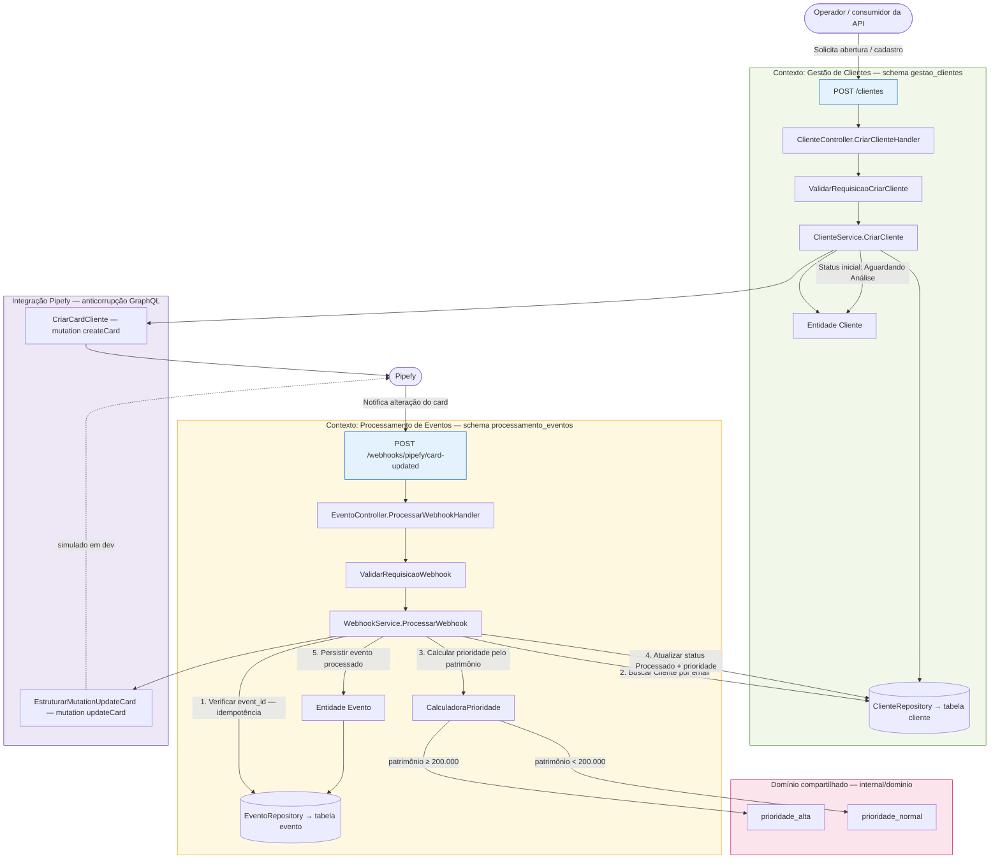

# Mundo Invest - Sistema de Gestão de Clientes

Sistema de gestão de clientes com integração ao Pipefy, processamento de webhooks e cálculo automático de prioridade baseado em patrimônio.

## 📋 Descrição

O Mundo Invest é um sistema backend desenvolvido em Go que gerencia o cadastro de clientes e processa eventos do Pipefy de forma idempotente. O sistema calcula automaticamente o nível de prioridade dos clientes baseado no valor do patrimônio e atualiza os cards no Pipefy através de mutations GraphQL.

## Visão simplificada

O backend atende dois momentos do fluxo de negócio:

1. **Cadastro do cliente** — recebe uma solicitação (`POST /clientes`), valida os dados, persiste o cliente com status *Aguardando Análise* e cria o card correspondente no Pipefy.
2. **Atualização via Pipefy** — quando o card muda no Pipefy, um webhook (`POST /webhooks/pipefy/card-updated`) dispara o recálculo de prioridade pelo patrimônio, atualiza o cliente para *Processado* e registra o evento de forma idempotente.

A organização do código segue **contextos delimitados (DDD)** em `internal/`, com linguagem ubíqua em português. Detalhes operacionais (Docker, testes, endpoints) continuam nas seções abaixo.

## Storytelling DDD e fluxo das rotas

O diagrama abaixo conta a história do negócio em um único fluxo: atores externos, contextos delimitados, domínio compartilhado, integração anticorrupção com o Pipefy e o caminho HTTP de cada rota dentro do respectivo contexto.



**Narrativa em sequência**

| Passo | Rota | O que o negócio entende |
|-------|------|-------------------------|
| 1 | `POST /clientes` | Nova **Solicitação** de cliente: nome, e-mail, tipo e **Patrimônio** entram no contexto de **Gestão de Clientes**. |
| 2 | (interno) | Cliente fica **Aguardando Análise**; um **Card** é criado no Pipefy e o identificador externo é gravado. |
| 3 | `POST /webhooks/pipefy/card-updated` | Pipefy envia um **Evento** ao contexto de **Processamento de Eventos**. |
| 4 | (interno) | Se o `event_id` já existir, nada é reprocessado (idempotência). Caso contrário, o cliente é localizado pelo e-mail. |
| 5 | (interno) | A **CalculadoraPrioridade** classifica o atendimento; o cliente passa a **Processado** e o card recebe a prioridade (mutation simulada ou real conforme ambiente). |

## 🚀 Tecnologias Utilizadas

- **Go 1.21+**: Linguagem de programação principal
- **PostgreSQL 15**: Banco de dados relacional
- **Docker**: Containerização do banco de dados
- **Pipefy API**: Integração para gestão de cards
- **GraphQL**: Mutations para integração com Pipefy

## 📐 Arquitetura

O projeto segue os princípios de **Domain-Driven Design (DDD)** com **Feature Folders**:

```
internal/
├── gestao_clientes/          # Contexto: Gestão de Clientes
│   ├── controller.go        # Camada de apresentação
│   ├── service.go           # Camada de serviço
│   ├── repository.go        # Camada de persistência
│   └── validator.go         # Validação de dados
├── processamento_eventos/   # Contexto: Processamento de Eventos
│   ├── controller.go        # Camada de apresentação
│   ├── service.go           # Camada de serviço
│   ├── repository.go        # Camada de persistência
│   └── validator.go         # Validação de dados
├── dominio/                 # Contexto: Domínio Compartilhado
│   └── prioridade_calculator.go  # Lógica de cálculo de prioridade
├── integracao_pipefy/       # Contexto: Integração Pipefy
│   ├── client.go           # Cliente GraphQL
│   └── mutations.go        # Mutations GraphQL
└── shared/                  # Contexto: Compartilhado
    └── database/            # Configuração de banco de dados
        ├── connection.go    # Conexão com PostgreSQL
        └── transacao.go     # Gerenciamento de transações
```

## 🏗️ Modelagem de Dados

### Linguagem Ubíqua e Trigramação

O sistema utiliza **linguagem ubíqua** e **trigramação** para nomenclatura de tabelas e colunas:

- **Schemas**: `gestao_clientes` (gcl), `processamento_eventos` (pev)
- **Tabelas**: `cliente` (cli), `evento` (eve)
- **Colunas**: `gcl_cli_int` (identificador interno), `gcl_cli_ema` (email), etc.

### Schemas Delimitados

- **gestao_clientes**: Contexto de gestão de clientes
- **processamento_eventos**: Contexto de processamento de eventos do Pipefy

## 📦 Pré-requisitos

- Go 1.21 ou superior
- Docker e Docker Compose
- PostgreSQL 15 (via Docker)
- Git

## 🔧 Instalação

1. **Clone o repositório**:
```bash
git clone <repositorio>
cd MundoInvest
```

2. **Instale as dependências**:
```bash
go mod download
```

3. **Configure variáveis de ambiente**:
```bash
cp .env.example .env
# Edite .env se necessário (Pipefy, etc.)
```

4. **Configure o banco de dados**:
```bash
docker compose up -d
```

5. **Execute as migrations** (se necessário):
```bash
docker exec postgres_container psql -U postgres -d mundo_invest -f migrations_simple/001_criar_schemas.sql
docker exec postgres_container psql -U postgres -d mundo_invest -f migrations_simple/002_criar_sequencias.sql
docker exec postgres_container psql -U postgres -d mundo_invest -f migrations_simple/003_criar_tabela_cliente.sql
docker exec postgres_container psql -U postgres -d mundo_invest -f migrations_simple/004_criar_tabela_evento.sql
```

## 🎯 Execução

### Subir API e banco com Docker (recomendado)

```bash
cp .env.example .env   # se ainda não existir
docker compose up -d --build
```

A API fica em `http://localhost:8080`. O Postgres continua exposto na porta `5434` do host, se precisar acessar de fora do Docker.

Logs da API:

```bash
docker compose logs -f app
```

### Iniciar o servidor localmente (Go no host)

Requer Postgres rodando (`docker compose up -d postgres`). No `.env`, use `DB_HOST=localhost` e `DB_PORT=5434`:

```bash
go run cmd/server/main.go
```

### Build do Binário

```bash
go build -o server cmd/server/main.go
./server
```

O servidor iniciará na porta 8080 (configurável via variável de ambiente `PORT`).

## 🧪 Executar Testes

### Testes Unitários

```bash
# Executar todos os testes unitários
go test ./... -v -short

# Executar testes de um contexto específico
go test ./internal/gestao_clientes/... -v
go test ./internal/processamento_eventos/... -v
go test ./internal/dominio/... -v
```

### Testes de Integração

```bash
# Executar testes de integração (requer banco de dados)
go test ./internal/shared/database/... -v -tags=integration

# Com variáveis de ambiente
DB_HOST=localhost DB_PORT=5434 DB_USER=postgres DB_PASSWORD=postgres DB_NAME=mundo_invest go test ./internal/shared/database/... -v -tags=integration
```

### Cobertura de Testes

```bash
# Gerar relatório de cobertura
go test ./... -coverprofile=coverage.out -short
go tool cover -html=coverage.out -o coverage.html

# Verificar cobertura no terminal
go tool cover -func=coverage.out
```

## 📡 API Endpoints

### POST /clientes

Cria um novo cliente e integra com o Pipefy.

**Exemplo**:
```bash
curl -X POST http://localhost:8080/clientes \
  -H "Content-Type: application/json" \
  -d '{
    "cliente_nome": "João Silva",
    "cliente_email": "joao.silva@example.com",
    "tipo_solicitacao": "abertura_conta",
    "valor_patrimonio": 150000.00
  }'
```

**Resposta** (HTTP 201):
```json
{
  "mensagem": "Cliente criado com sucesso",
  "identificador_interno": 1,
  "identificador_externo": "card_123",
  "cliente_nome": "João Silva",
  "cliente_email": "joao.silva@example.com",
  "valor_patrimonio": 150000.00,
  "tipo_solicitacao": "abertura_conta",
  "status": "Aguardando Análise",
  "data_criacao": "2026-05-27T10:00:00Z"
}
```

### POST /webhooks/pipefy/card-updated

Processa webhooks do Pipefy de forma idempotente.

**Exemplo**:
```bash
curl -X POST http://localhost:8080/webhooks/pipefy/card-updated \
  -H "Content-Type: application/json" \
  -d '{
    "event_id": "evt_12345",
    "card_id": "card_67890",
    "cliente_email": "joao.silva@example.com",
    "timestamp": "2026-05-27T10:00:00Z"
  }'
```

**Resposta** (HTTP 200):
```json
{
  "mensagem": "Webhook processado com sucesso",
  "event_id": "evt_12345",
  "card_id": "card_67890",
  "cliente_email": "joao.silva@example.com"
}
```

## 🎲 Regras de Negócio

### Cálculo de Prioridade

O sistema calcula automaticamente o nível de prioridade baseado no patrimônio:

- **Prioridade Alta**: `valor_patrimonio >= 200.000`
- **Prioridade Normal**: `valor_patrimonio < 200.000`

### Idempotência

O sistema garante idempotência no processamento de webhooks através do `identificador_evento`. Eventos duplicados não são reprocessados.

### Validações

- **Email**: Deve ser válido e único
- **Patrimônio**: Deve ser maior que zero
- **Campos obrigatórios**: nome, email, tipoSolicitacao, valorPatrimonio

## 🔐 Segurança

### RBAC (Role-Based Access Control)

O sistema implementa controle de acesso baseado em roles:

- **app_user**: Usuário da aplicação com permissões limitadas
- **app_admin**: Administrador com permissões completas
- **app_readonly**: Usuário somente leitura

### Auditoria

Todas as operações são auditadas na tabela `auditoria.auditoria_clientes`.

## 📊 Monitoramento e Backup

### Backup Automático

O sistema possui scripts de backup automático configurados no Docker Compose.

### Snapshot do Banco de Dados

Snapshots são criados regularmente para recuperação de desastres.

## 🧹 Limpeza

### Parar Serviços

```bash
# Parar servidor
Ctrl+C

# Parar Docker Compose
docker-compose down

# Parar e remover volumes
docker-compose down -v
```

## 🐛 Troubleshooting

### Erro de Conexão com Banco de Dados

```bash
# Verificar se o container está rodando
docker ps

# Verificar logs do container
docker logs postgres_container

# Reiniciar o container
docker-compose restart
```

### Erro de Porta

```bash
# Verificar qual processo está usando a porta 8080
lsof -i :8080

# Mudar a porta do servidor
PORT=8081 go run cmd/server/main.go
```

### Erro de Testes

```bash
# Verificar se o banco de dados de teste está configurado
docker-compose up -d

# Executar testes com verbose
go test ./... -v

# Executar testes específicos
go test ./internal/gestao_clientes/... -v -run TestCriarClienteHandler
```

## 📚 Documentação Adicional

- [Regras de Negócio](docs/regras-negocio.md)
- [Requisitos Funcionais](docs/requisitos-funcionais.md)
- [Modelagem de Dados](docs/modelagem-dados.md)
- [Snapshot do Banco de Dados](docs/snapshot-banco-dados.md)
- [Planos de Implementação](planos/)

## 👥 Autores

- Equipe de Desenvolvimento Mundo Invest

## 📄 Licença

Este projeto é proprietário e confidencial.

## 🤝 Contribuindo

Para contribuir com este projeto, siga os seguintes passos:

1. Fork o repositório
2. Crie uma branch para sua feature (`git checkout -b feature/nova-feature`)
3. Commit suas mudanças (`git commit -m 'Adiciona nova feature'`)
4. Push para a branch (`git push origin feature/nova-feature`)
5. Abra um Pull Request

## 📞 Suporte

Para suporte, entre em contato com a equipe de desenvolvimento.

---

**Versão**: 1.0.0  
**Última Atualização**: 27/05/2026
