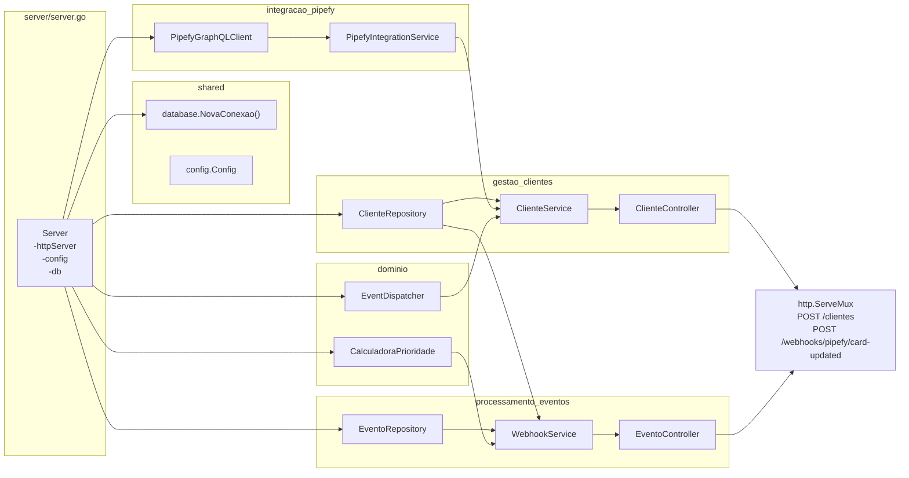
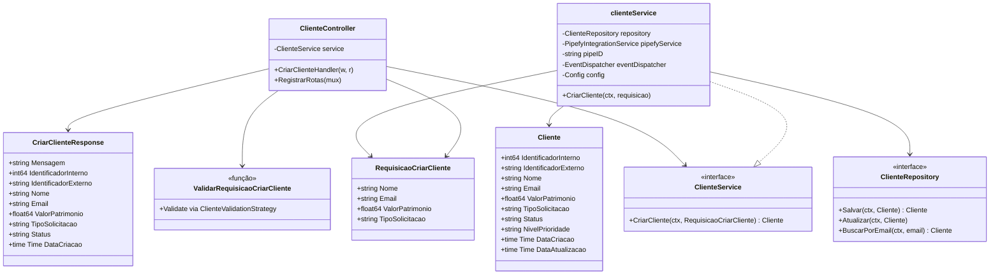
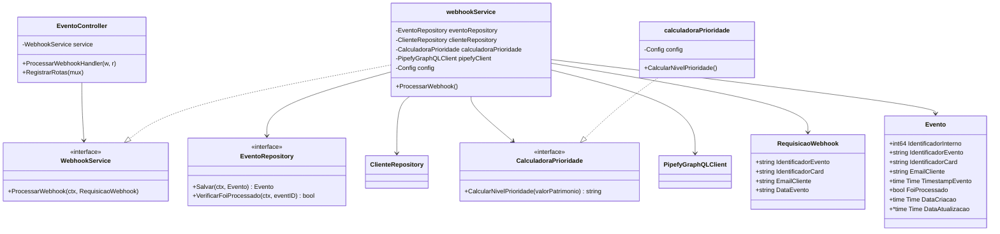
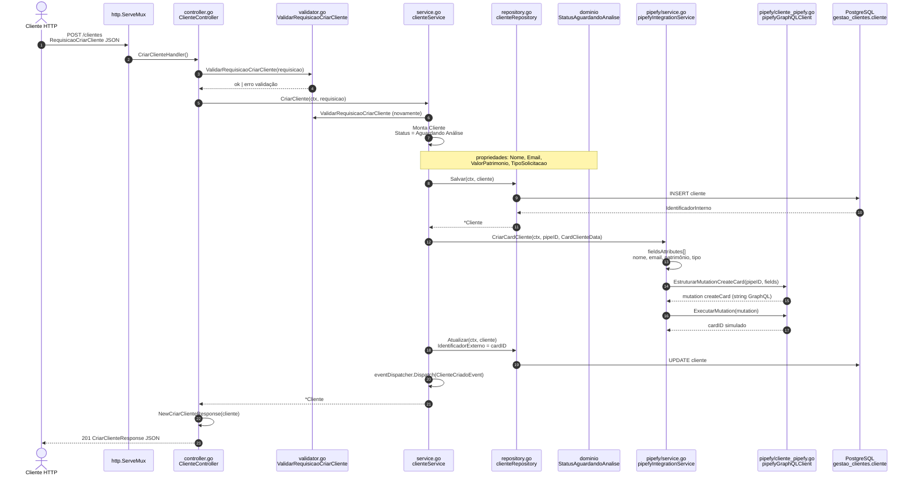
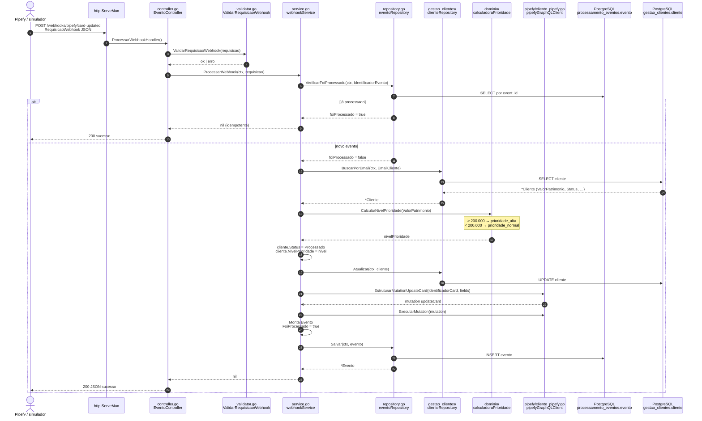

# Diagrama de rotas, classes e sequência

Documentação visual do fluxo HTTP: arquivos, tipos, propriedades e métodos envolvidos em cada rota.

> **Legenda:** `+` método público · `-` dependência/campo privado · tipos em *itálico* são DTOs/entradas HTTP.

---

## 1. Composição na subida do servidor

Montagem em `internal/server/server.go` (`NewServer`).



---

## 2. Diagrama de classes por contexto

### 2.1 Gestão de Clientes — `POST /clientes`



**Arquivos**

| Tipo | Arquivo |
|------|---------|
| Controller | `internal/gestao_clientes/controller.go` |
| Service | `internal/gestao_clientes/service.go` |
| Entidade / Repository | `internal/gestao_clientes/repository.go` |
| DTO entrada | `internal/gestao_clientes/validator.go` (`RequisicaoCriarCliente`) |
| DTO saída | `internal/gestao_clientes/dto.go` |
| Validação | `internal/gestao_clientes/validator.go`, `validation_strategy.go` |

### 2.2 Integração Pipefy (fluxo criação de card)

```mermaid
classDiagram
    direction TB

    class PipefyIntegrationService {
        <<interface>>
        +CriarCardCliente(ctx, pipeID, CardClienteData) string
        +AtualizarCardPrioridade(ctx, cardID, nivelPrioridade)
    }

    class pipefyIntegrationService {
        -PipefyGraphQLClient client
        -Config config
        +CriarCardCliente()
        +AtualizarCardPrioridade()
    }

    class CardClienteData {
        +string Nome
        +string Email
        +float64 ValorPatrimonio
        +string TipoSolicitacao
    }

    class PipefyGraphQLClient {
        <<interface>>
        +EstruturarMutationCreateCard(pipeID, fields) string
        +EstruturarMutationUpdateCard(cardID, fields) string
        +ExecutarMutation(mutation) string
    }

    class pipefyGraphQLClient {
        -string apiToken
        -string apiURL
        +EstruturarMutationCreateCard()
        +EstruturarMutationUpdateCard()
        +ExecutarMutation()
    }

    class FieldAttribute {
        +string FieldID
        +[]string Values
    }

    class Mutacoes {
        -PipefyGraphQLClient cliente
        +CreateCardMutation()
        +UpdateCardMutation()
    }

    pipefyIntegrationService ..|> PipefyIntegrationService
    pipefyIntegrationService --> PipefyGraphQLClient
    pipefyGraphQLClient ..|> PipefyGraphQLClient
    pipefyIntegrationService --> CardClienteData
    pipefyGraphQLClient --> FieldAttribute
    Mutacoes --> PipefyGraphQLClient
    Mutacoes ..> "não usado em server.go" : legado
```

**Arquivos**

| Camada | Arquivo |
|--------|---------|
| Serviço aplicação | `internal/integracao_pipefy/service.go` |
| Cliente GraphQL | `internal/integracao_pipefy/cliente_pipefy.go` |
| Facade opcional | `internal/integracao_pipefy/mutacoes.go` *(não ligado ao `server`)* |

### 2.3 Processamento de Eventos — `POST /webhooks/pipefy/card-updated`



**Arquivos**

| Tipo | Arquivo |
|------|---------|
| Controller | `internal/processamento_eventos/controller.go` |
| Service | `internal/processamento_eventos/service.go` |
| Entidade / Repository | `internal/processamento_eventos/repository.go` |
| DTO entrada | `internal/processamento_eventos/validator.go` |
| Domínio | `internal/dominio/calculadora_prioridade.go` |
| Pipefy (update) | `internal/integracao_pipefy/cliente_pipefy.go` |

---

## 3. Sequência — `POST /clientes`



---

## 4. Sequência — `POST /webhooks/pipefy/card-updated`



---

## 5. Mapa arquivo → responsabilidade

| Ordem | Arquivo | Papel na rota |
|------|---------|----------------|
| 1 | `cmd/server/main.go` | `godotenv`, `config.Load`, `server.NewServer` |
| 2 | `internal/server/server.go` | DI, rotas, `ListenAndServe` |
| 3a | `gestao_clientes/controller.go` | HTTP `POST /clientes` |
| 3b | `processamento_eventos/controller.go` | HTTP `POST /webhooks/...` |
| 4a | `gestao_clientes/service.go` | Regra de criação + orquestração Pipefy |
| 4b | `processamento_eventos/service.go` | Idempotência, prioridade, update Pipefy |
| 5 | `gestao_clientes/repository.go` | Persistência `Cliente` |
| 6 | `processamento_eventos/repository.go` | Persistência `Evento` |
| 7 | `dominio/calculadora_prioridade.go` | Regra patrimônio → prioridade |
| 8 | `integracao_pipefy/service.go` | Caso de uso createCard (rota clientes) |
| 9 | `integracao_pipefy/cliente_pipefy.go` | Strings GraphQL createCard / updateCard |
| — | `integracao_pipefy/mutacoes.go` | Alternativa não usada pelo `server` |

---

## 6. Referência rápida das rotas

| Método | Rota | Handler | Service | Persistência | Pipefy |
|--------|------|---------|---------|--------------|--------|
| POST | `/clientes` | `ClienteController.CriarClienteHandler` | `clienteService.CriarCliente` | `ClienteRepository` | `PipefyIntegrationService` → `PipefyGraphQLClient` |
| POST | `/webhooks/pipefy/card-updated` | `EventoController.ProcessarWebhookHandler` | `webhookService.ProcessarWebhook` | `EventoRepository` + `ClienteRepository` | `PipefyGraphQLClient` direto (`updateCard`) |

---

*Gerado a partir do código em `internal/` — alinhar após refactors (ex.: unificar webhook com `PipefyIntegrationService`).*
