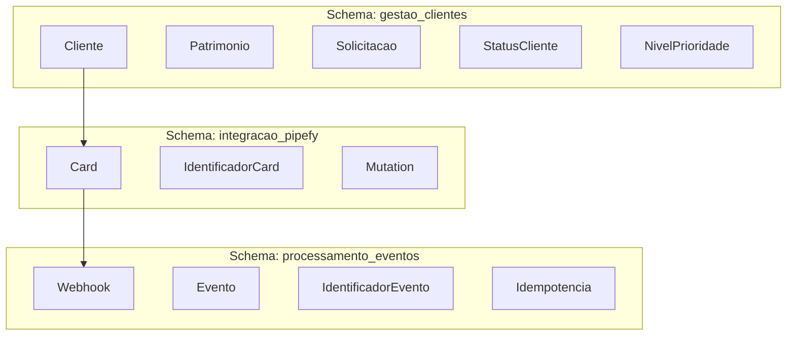
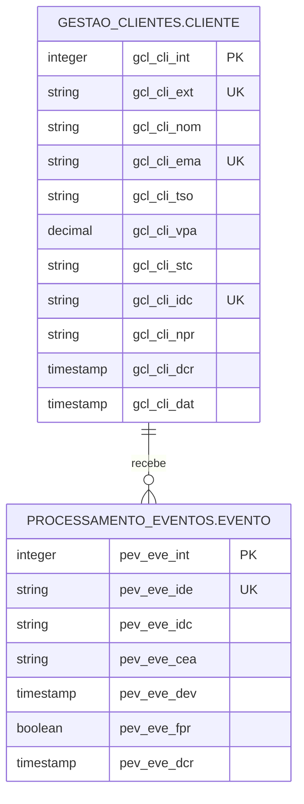
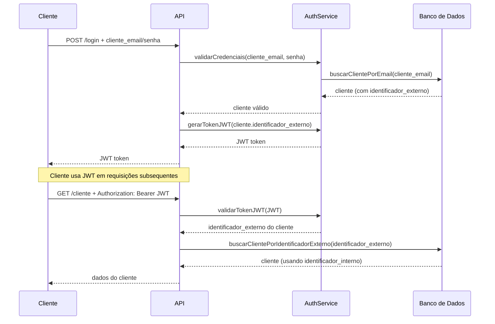

# Modelagem de Dados - Mundo Invest

## Visão Geral

Este documento apresenta a modelagem de dados do sistema de gestão de clientes e integração com Pipefy, seguindo os princípios de Domain-Driven Design (DDD), normalização de dados (3NF) e linguagem ubíqua do domínio Mundo Invest.

## Contextos Delimitados (Bounded Contexts)

O sistema está organizado em três contextos delimitados, cada um com seu próprio schema no banco de dados e linguagem ubíqua:



### Schemas do Banco de Dados

**Schema: gestao_clientes**
- Tabelas relacionadas ao contexto de Gestão de Clientes
- Linguagem ubíqua: Cliente, Patrimonio, Solicitacao, StatusCliente, NivelPrioridade

**Schema: integracao_pipefy**
- Tabelas relacionadas ao contexto de Integração Pipefy
- Linguagem ubíqua: Card, IdentificadorCard, Mutation, Query

**Schema: processamento_eventos**
- Tabelas relacionadas ao contexto de Processamento de Eventos
- Linguagem ubíqua: Webhook, Evento, IdentificadorEvento, Idempotencia

### 1. Contexto: Gestão de Clientes
**Linguagem Ubíqua:** Cliente, Patrimonio, Solicitacao, StatusCliente, NivelPrioridade

**Responsabilidade:** Gerenciar o ciclo de vida de clientes e seus patrimônios investidos.

**História:** No Mundo Invest, cada Cliente possui um Patrimonio que determina sua prioridade de atendimento. Quando um Cliente inicia uma Solicitacao, ele é acompanhado através de diferentes StatusCliente até sua conclusão.

### 2. Contexto: Integração Pipefy
**Linguagem Ubíqua:** Card, IdentificadorCard, Mutation, Query, Pipefy

**Responsabilidade:** Mapear clientes para cards no Pipefy e sincronizar atualizações.

**História:** Cada Cliente é representado por um Card no Pipefy, onde a equipe operacional acompanha o progresso da Solicitacao. O IdentificadorCard permite rastrear essa correspondência.

### 3. Contexto: Processamento de Eventos
**Linguagem Ubíqua:** Webhook, Evento, IdentificadorEvento, Idempotencia, Processamento

**Responsabilidade:** Processar eventos do Pipefy de forma idempotente e segura.

**História:** Quando um Card é atualizado no Pipefy, um Webhook é disparado contendo um Evento. O IdentificadorEvento garante Idempotencia, evitando processamentos duplicados.

## Estratégia de Identificação

O sistema utiliza uma estratégia de dupla identificação para balancear performance e segurança:

- **Identificador Interno (Aplicação/Banco)**: Inteiro auto-incremento
  - Usado internamente para performance em joins e índices
  - Não exposto externamente
  - Exemplo: `1`, `2`, `3`, `4`

- **Identificador Externo (API/JWT)**: UUID v4
  - Usado em APIs públicas e tokens JWT
  - Mapeia para o identificador interno
  - Exemplo: `550e8400-e29b-41d4-a716-446655440000`

### Autenticação JWT

O sistema usa JWT (JSON Web Tokens) para autenticação:

- **Payload do JWT**: Contém o UUID do cliente
- **Mapeamento**: UUID → Identificador Interno via tabela de mapeamento
- **Benefícios**: Não expõe identificadores internos, permite revogação, escalável

## Diagrama Entidade-Relacionamento (ER)



## Normalização de Dados

A modelagem segue a Terceira Forma Normal (3NF):

### 1FN (Primeira Forma Normal)
- Todos os atributos são atômicos
- Não há grupos repetitivos
- Cada célula contém um único valor

### 2FN (Segunda Forma Normal)
- Todos os atributos não-chave dependem totalmente da chave primária
- Não há dependências parciais

### 3FN (Terceira Forma Normal)
- Não há dependências transitivas
- Atributos não-chave dependem apenas da chave primária

**Exemplo de Normalização Aplicada:**
- Antes: `cliente` com dados de `card` embutidos
- Depois: `cliente` e `evento` separados, com relacionamento via `identificador_card`

## Tabelas Detalhadas

### Tabela: cliente

**Schema:** gestao_clientes

**Contexto:** Gestão de Clientes

**História:** A tabela `cliente` representa a entidade central do domínio Mundo Invest. Cada Cliente é um investidor que possui um Patrimonio e realiza Solicitacoes que são processadas pela equipe operacional.

| Coluna (Trigramada) | Coluna (Completa) | Tipo | Constraint | Descrição | Exemplo |
|-------------------|------------------|------|------------|-----------|---------|
| gcl_cli_int | gestao_clientes_cliente_identificador_interno | INTEGER | PRIMARY KEY | Identificador interno (SEQUÊNCIA) | 1, 2, 3, 4 |
| gcl_cli_ext | gestao_clientes_cliente_identificador_externo | UUID | NOT NULL, UNIQUE | Identificador externo (usado em APIs e JWT) | "550e8400-e29b-41d4-a716-446655440000" |
| gcl_cli_nom | gestao_clientes_cliente_nome | VARCHAR(255) | NOT NULL | Nome completo do Cliente | "João Silva" |
| gcl_cli_ema | gestao_clientes_cliente_email | VARCHAR(255) | NOT NULL, UNIQUE | E-mail do Cliente (usado para busca) | "joao.silva@example.com" |
| gcl_cli_tso | gestao_clientes_cliente_tipo_solicitacao | VARCHAR(100) | NOT NULL | Tipo de Solicitacao do Cliente | "Atualização cadastral" |
| gcl_cli_vpa | gestao_clientes_cliente_valor_patrimonio | DECIMAL(15,2) | NOT NULL, CHECK > 0 | Valor do Patrimonio investido | 250000.00 |
| gcl_cli_stc | gestao_clientes_cliente_status_cliente | VARCHAR(50) | NOT NULL, DEFAULT "Aguardando Análise" | StatusCliente atual do Cliente | "Aguardando Análise", "Processado" |
| gcl_cli_idc | gestao_clientes_cliente_identificador_card | VARCHAR(100) | UNIQUE | Identificador do Card no Pipefy | "card_456" |
| gcl_cli_npr | gestao_clientes_cliente_nivel_prioridade | VARCHAR(50) | NULL | NivelPrioridade calculado (NULL até processamento) | "prioridade_alta", "prioridade_normal" |
| gcl_cli_dcr | gestao_clientes_cliente_data_criacao | TIMESTAMP | NOT NULL, DEFAULT NOW() | Data/hora de criação | "2026-05-18T12:00:00Z" |
| gcl_cli_dat | gestao_clientes_cliente_data_atualizacao | TIMESTAMP | NOT NULL, DEFAULT NOW() | Data/hora da última atualização | "2026-05-18T13:00:00Z" |

#### Índices Sugeridos

```sql
-- Schema: gestao_clientes
CREATE SCHEMA IF NOT EXISTS gestao_clientes;

-- Sequência para cliente
CREATE SEQUENCE gestao_clientes.seq_gcl_cli_int
    START WITH 1
    INCREMENT BY 1
    NO MINVALUE
    NO MAXVALUE
    CACHE 1;

-- Tabela cliente
CREATE TABLE gestao_clientes.cliente (
    gcl_cli_int INTEGER PRIMARY KEY DEFAULT nextval('gestao_clientes.seq_gcl_cli_int'),
    gcl_cli_ext UUID NOT NULL UNIQUE DEFAULT uuid_generate_v4(),
    gcl_cli_nom VARCHAR(255) NOT NULL,
    gcl_cli_ema VARCHAR(255) NOT NULL UNIQUE,
    gcl_cli_tso VARCHAR(100) NOT NULL,
    gcl_cli_vpa DECIMAL(15,2) NOT NULL CHECK (gcl_cli_vpa > 0),
    gcl_cli_stc VARCHAR(50) NOT NULL DEFAULT 'Aguardando Análise',
    gcl_cli_idc VARCHAR(100) UNIQUE,
    gcl_cli_npr VARCHAR(50),
    gcl_cli_dcr TIMESTAMP NOT NULL DEFAULT NOW(),
    gcl_cli_dat TIMESTAMP NOT NULL DEFAULT NOW()
);

-- Índice para busca por e-mail (já coberto pelo UNIQUE, mas explícito para performance)
CREATE INDEX idx_gcl_cli_ema ON gestao_clientes.cliente(gcl_cli_ema);

-- Índice para busca por identificador_externo (usado em APIs e JWT)
CREATE INDEX idx_gcl_cli_ext ON gestao_clientes.cliente(gcl_cli_ext);

-- Índice para busca por status_cliente (para consultas de clientes pendentes)
CREATE INDEX idx_gcl_cli_stc ON gestao_clientes.cliente(gcl_cli_stc);

-- Índice para busca por nivel_prioridade (para relatórios)
CREATE INDEX idx_gcl_cli_npr ON gestao_clientes.cliente(gcl_cli_npr);

-- Índice composto para consultas comuns (status_cliente + nivel_prioridade)
CREATE INDEX idx_gcl_cli_stc_npr ON gestao_clientes.cliente(gcl_cli_stc, gcl_cli_npr);

-- Índice para busca por identificador_card (integração Pipefy)
CREATE INDEX idx_gcl_cli_idc ON gestao_clientes.cliente(gcl_cli_idc);
```

#### Constraints Adicionais

```sql
-- Constraint para garantir valores válidos de status_cliente
ALTER TABLE gestao_clientes.cliente 
ADD CONSTRAINT chk_gcl_cli_stc 
CHECK (gcl_cli_stc IN ('Aguardando Análise', 'Processado'));

-- Constraint para garantir valores válidos de nivel_prioridade
ALTER TABLE gestao_clientes.cliente 
ADD CONSTRAINT chk_gcl_cli_npr 
CHECK (gcl_cli_npr IS NULL OR gcl_cli_npr IN ('prioridade_alta', 'prioridade_normal'));

-- Trigger para atualizar data_atualizacao automaticamente
CREATE OR REPLACE FUNCTION gestao_clientes.fnc_atualizar_gcl_cli_dat()
RETURNS TRIGGER AS $$
BEGIN
    NEW.gcl_cli_dat = NOW();
    RETURN NEW;
END;
$$ LANGUAGE plpgsql;

CREATE TRIGGER trg_gcl_cli_dat
BEFORE UPDATE ON gestao_clientes.cliente
FOR EACH ROW
EXECUTE FUNCTION gestao_clientes.fnc_atualizar_gcl_cli_dat();
```

### Tabela: evento

**Schema:** processamento_eventos

**Contexto:** Processamento de Eventos

**História:** A tabela `evento` armazena Webhooks recebidos do Pipefy para controle de Idempotencia. Cada Evento representa uma atualização de Card e garante que o mesmo IdentificadorEvento não seja processado múltiplas vezes.

| Coluna (Trigramada) | Coluna (Completa) | Tipo | Constraint | Descrição | Exemplo |
|-------------------|------------------|------|------------|-----------|---------|
| pev_eve_int | processamento_eventos_evento_identificador_interno | INTEGER | PRIMARY KEY | Identificador interno (SEQUÊNCIA) | 1, 2, 3, 4 |
| pev_eve_ide | processamento_eventos_evento_identificador_evento | VARCHAR(255) | NOT NULL, UNIQUE | Identificador do Evento do Pipefy | "evt_123" |
| pev_eve_idc | processamento_eventos_evento_identificador_card | VARCHAR(100) | NOT NULL | Identificador do Card relacionado | "card_456" |
| pev_eve_cea | processamento_eventos_evento_cliente_email | VARCHAR(255) | NOT NULL | E-mail do Cliente (para rastreabilidade) | "joao.silva@example.com" |
| pev_eve_dev | processamento_eventos_evento_data_evento | TIMESTAMP | NOT NULL | Data do Evento original | "2026-05-18T12:00:00Z" |
| pev_eve_fpr | processamento_eventos_evento_foi_processado | BOOLEAN | NOT NULL, DEFAULT FALSE | Indica se Evento foi processado | true |
| pev_eve_dcr | processamento_eventos_evento_data_criacao | TIMESTAMP | NOT NULL, DEFAULT NOW() | Data/hora de registro do Evento | "2026-05-18T12:00:00Z" |

#### Índices Sugeridos

```sql
-- Schema: processamento_eventos
CREATE SCHEMA IF NOT EXISTS processamento_eventos;

-- Sequência para evento
CREATE SEQUENCE processamento_eventos.seq_pev_eve_int
    START WITH 1
    INCREMENT BY 1
    NO MINVALUE
    NO MAXVALUE
    CACHE 1;

-- Tabela evento
CREATE TABLE processamento_eventos.evento (
    pev_eve_int INTEGER PRIMARY KEY DEFAULT nextval('processamento_eventos.seq_pev_eve_int'),
    pev_eve_ide VARCHAR(255) NOT NULL UNIQUE,
    pev_eve_idc VARCHAR(100) NOT NULL,
    pev_eve_cea VARCHAR(255) NOT NULL,
    pev_eve_dev TIMESTAMP NOT NULL,
    pev_eve_fpr BOOLEAN NOT NULL DEFAULT FALSE,
    pev_eve_dcr TIMESTAMP NOT NULL DEFAULT NOW()
);

-- Índice para verificação de idempotência (já coberto pelo UNIQUE)
CREATE INDEX idx_pev_eve_ide ON processamento_eventos.evento(pev_eve_ide);

-- Índice para busca por cliente_email (rastreabilidade)
CREATE INDEX idx_pev_eve_cea ON processamento_eventos.evento(pev_eve_cea);

-- Índice para busca por identificador_card (relacionamento com Pipefy)
CREATE INDEX idx_pev_eve_idc ON processamento_eventos.evento(pev_eve_idc);

-- Índice para consultas de eventos processados
CREATE INDEX idx_pev_eve_fpr ON processamento_eventos.evento(pev_eve_fpr);

-- Índice para consultas por período (data_evento)
CREATE INDEX idx_pev_eve_dev ON processamento_eventos.evento(pev_eve_dev);
```

#### Constraints Adicionais

```sql
-- Constraint para garantir formato válido de identificador_evento
ALTER TABLE processamento_eventos.evento 
ADD CONSTRAINT chk_pev_eve_ide_format 
CHECK (pev_eve_ide ~ '^evt_[a-zA-Z0-9_]+$');

-- Constraint para garantir formato válido de identificador_card
ALTER TABLE processamento_eventos.evento 
ADD CONSTRAINT chk_pev_eve_idc_format 
CHECK (pev_eve_idc ~ '^card_[a-zA-Z0-9_]+$');
```

## Views (Visões)

As views são criadas para facilitar o acesso aos dados, esconder a complexidade das colunas trigramadas e fornecer uma interface mais amigável para a aplicação.

### View: vw_cliente

**Schema:** gestao_clientes

**Propósito:** Fornecer acesso à tabela cliente com nomes de colunas legíveis

```sql
CREATE OR REPLACE VIEW gestao_clientes.vw_cliente AS
SELECT 
    gcl_cli_int AS identificador_interno,
    gcl_cli_ext AS identificador_externo,
    gcl_cli_nom AS cliente_nome,
    gcl_cli_ema AS cliente_email,
    gcl_cli_tso AS tipo_solicitacao,
    gcl_cli_vpa AS valor_patrimonio,
    gcl_cli_stc AS status_cliente,
    gcl_cli_idc AS identificador_card,
    gcl_cli_npr AS nivel_prioridade,
    gcl_cli_dcr AS data_criacao,
    gcl_cli_dat AS data_atualizacao
FROM gestao_clientes.cliente;
```

### View: vw_evento

**Schema:** processamento_eventos

**Propósito:** Fornecer acesso à tabela evento com nomes de colunas legíveis

```sql
CREATE OR REPLACE VIEW processamento_eventos.vw_evento AS
SELECT 
    pev_eve_int AS identificador_interno,
    pev_eve_ide AS identificador_evento,
    pev_eve_idc AS identificador_card,
    pev_eve_cea AS cliente_email,
    pev_eve_dev AS data_evento,
    pev_eve_fpr AS foi_processado,
    pev_eve_dcr AS data_criacao
FROM processamento_eventos.evento;
```

### View: vw_cliente_com_eventos

**Schema:** gestao_clientes

**Propósito:** Fornecer visão consolidada de cliente com seus eventos

```sql
CREATE OR REPLACE VIEW gestao_clientes.vw_cliente_com_eventos AS
SELECT 
    c.gcl_cli_int AS identificador_interno,
    c.gcl_cli_ext AS identificador_externo,
    c.gcl_cli_nom AS cliente_nome,
    c.gcl_cli_ema AS cliente_email,
    c.gcl_cli_tso AS tipo_solicitacao,
    c.gcl_cli_vpa AS valor_patrimonio,
    c.gcl_cli_stc AS status_cliente,
    c.gcl_cli_idc AS identificador_card,
    c.gcl_cli_npr AS nivel_prioridade,
    c.gcl_cli_dcr AS data_criacao,
    c.gcl_cli_dat AS data_atualizacao,
    COUNT(e.pev_eve_int) AS total_eventos,
    MAX(e.pev_eve_dev) AS ultimo_evento_data
FROM gestao_clientes.cliente c
LEFT JOIN processamento_eventos.evento e ON c.gcl_cli_ema = e.pev_eve_cea
GROUP BY c.gcl_cli_int, c.gcl_cli_ext, c.gcl_cli_nom, c.gcl_cli_ema, 
         c.gcl_cli_tso, c.gcl_cli_vpa, c.gcl_cli_stc, c.gcl_cli_idc, 
         c.gcl_cli_npr, c.gcl_cli_dcr, c.gcl_cli_dat;
```

### View: vw_eventos_por_cliente

**Schema:** processamento_eventos

**Propósito:** Fornecer visão de eventos agrupados por cliente

```sql
CREATE OR REPLACE VIEW processamento_eventos.vw_eventos_por_cliente AS
SELECT 
    e.pev_eve_cea AS cliente_email,
    c.gcl_cli_nom AS cliente_nome,
    c.gcl_cli_npr AS nivel_prioridade,
    COUNT(e.pev_eve_int) AS total_eventos,
    SUM(CASE WHEN e.pev_eve_fpr = TRUE THEN 1 ELSE 0 END) AS eventos_processados,
    SUM(CASE WHEN e.pev_eve_fpr = FALSE THEN 1 ELSE 0 END) AS eventos_pendentes,
    MAX(e.pev_eve_dev) AS ultimo_evento_data
FROM processamento_eventos.evento e
LEFT JOIN gestao_clientes.cliente c ON e.pev_eve_cea = c.gcl_cli_ema
GROUP BY e.pev_eve_cea, c.gcl_cli_nom, c.gcl_cli_npr
ORDER BY total_eventos DESC;
```

## Relacionamentos

### Cliente ↔ Evento

- **Relacionamento**: Um Cliente pode ter múltiplos Eventos
- **Cardinalidade**: 1:N (Um para Muitos)
- **Integridade Referencial**: Soft (via cliente_email, não FK física)
- **Justificativa**: O Evento é armazenado independentemente para controle de Idempotencia, mas está associado ao Cliente via e-mail

```sql
-- Não usamos FK física porque:
-- 1. Eventos podem chegar antes do Cliente (ordem não garantida)
-- 2. Precisamos flexibilidade para reprocessamento
-- 3. A associação é via e-mail para simplificar a busca
```

## Scripts de Criação (PostgreSQL)

### Script Completo

```sql
-- Extensão para UUID (se necessário)
CREATE EXTENSION IF NOT EXISTS "uuid-ossp";

-- Criar schemas por contexto delimitado
CREATE SCHEMA IF NOT EXISTS gestao_clientes;
CREATE SCHEMA IF NOT EXISTS integracao_pipefy;
CREATE SCHEMA IF NOT EXISTS processamento_eventos;

-- Schema: gestao_clientes

-- Sequência para cliente
CREATE SEQUENCE gestao_clientes.seq_gcl_cli_int
    START WITH 1
    INCREMENT BY 1
    NO MINVALUE
    NO MAXVALUE
    CACHE 1;

-- Função para atualizar data_atualizacao
CREATE OR REPLACE FUNCTION gestao_clientes.fnc_atualizar_gcl_cli_dat()
RETURNS TRIGGER AS $$
BEGIN
    NEW.gcl_cli_dat = NOW();
    RETURN NEW;
END;
$$ LANGUAGE plpgsql;

-- Tabela cliente
CREATE TABLE gestao_clientes.cliente (
    gcl_cli_int INTEGER PRIMARY KEY DEFAULT nextval('gestao_clientes.seq_gcl_cli_int'),
    gcl_cli_ext UUID NOT NULL UNIQUE DEFAULT uuid_generate_v4(),
    gcl_cli_nom VARCHAR(255) NOT NULL,
    gcl_cli_ema VARCHAR(255) NOT NULL UNIQUE,
    gcl_cli_tso VARCHAR(100) NOT NULL,
    gcl_cli_vpa DECIMAL(15,2) NOT NULL CHECK (gcl_cli_vpa > 0),
    gcl_cli_stc VARCHAR(50) NOT NULL DEFAULT 'Aguardando Análise',
    gcl_cli_idc VARCHAR(100) UNIQUE,
    gcl_cli_npr VARCHAR(50),
    gcl_cli_dcr TIMESTAMP NOT NULL DEFAULT NOW(),
    gcl_cli_dat TIMESTAMP NOT NULL DEFAULT NOW(),
    
    CONSTRAINT chk_gcl_cli_stc CHECK (gcl_cli_stc IN ('Aguardando Análise', 'Processado')),
    CONSTRAINT chk_gcl_cli_npr CHECK (gcl_cli_npr IS NULL OR gcl_cli_npr IN ('prioridade_alta', 'prioridade_normal'))
);

-- Trigger para data_atualizacao
CREATE TRIGGER trg_gcl_cli_dat
BEFORE UPDATE ON gestao_clientes.cliente
FOR EACH ROW
EXECUTE FUNCTION gestao_clientes.fnc_atualizar_gcl_cli_dat();

-- Índices cliente
CREATE INDEX idx_gcl_cli_ema ON gestao_clientes.cliente(gcl_cli_ema);
CREATE INDEX idx_gcl_cli_ext ON gestao_clientes.cliente(gcl_cli_ext);
CREATE INDEX idx_gcl_cli_stc ON gestao_clientes.cliente(gcl_cli_stc);
CREATE INDEX idx_gcl_cli_npr ON gestao_clientes.cliente(gcl_cli_npr);
CREATE INDEX idx_gcl_cli_stc_npr ON gestao_clientes.cliente(gcl_cli_stc, gcl_cli_npr);
CREATE INDEX idx_gcl_cli_idc ON gestao_clientes.cliente(gcl_cli_idc);

-- Views cliente
CREATE OR REPLACE VIEW gestao_clientes.vw_cliente AS
SELECT 
    gcl_cli_int AS identificador_interno,
    gcl_cli_ext AS identificador_externo,
    gcl_cli_nom AS cliente_nome,
    gcl_cli_ema AS cliente_email,
    gcl_cli_tso AS tipo_solicitacao,
    gcl_cli_vpa AS valor_patrimonio,
    gcl_cli_stc AS status_cliente,
    gcl_cli_idc AS identificador_card,
    gcl_cli_npr AS nivel_prioridade,
    gcl_cli_dcr AS data_criacao,
    gcl_cli_dat AS data_atualizacao
FROM gestao_clientes.cliente;

-- Schema: processamento_eventos

-- Sequência para evento
CREATE SEQUENCE processamento_eventos.seq_pev_eve_int
    START WITH 1
    INCREMENT BY 1
    NO MINVALUE
    NO MAXVALUE
    CACHE 1;

-- Tabela evento
CREATE TABLE processamento_eventos.evento (
    pev_eve_int INTEGER PRIMARY KEY DEFAULT nextval('processamento_eventos.seq_pev_eve_int'),
    pev_eve_ide VARCHAR(255) NOT NULL UNIQUE,
    pev_eve_idc VARCHAR(100) NOT NULL,
    pev_eve_cea VARCHAR(255) NOT NULL,
    pev_eve_dev TIMESTAMP NOT NULL,
    pev_eve_fpr BOOLEAN NOT NULL DEFAULT FALSE,
    pev_eve_dcr TIMESTAMP NOT NULL DEFAULT NOW(),
    
    CONSTRAINT chk_pev_eve_ide_format CHECK (pev_eve_ide ~ '^evt_[a-zA-Z0-9_]+$'),
    CONSTRAINT chk_pev_eve_idc_format CHECK (pev_eve_idc ~ '^card_[a-zA-Z0-9_]+$')
);

-- Índices evento
CREATE INDEX idx_pev_eve_ide ON processamento_eventos.evento(pev_eve_ide);
CREATE INDEX idx_pev_eve_cea ON processamento_eventos.evento(pev_eve_cea);
CREATE INDEX idx_pev_eve_idc ON processamento_eventos.evento(pev_eve_idc);
CREATE INDEX idx_pev_eve_fpr ON processamento_eventos.evento(pev_eve_fpr);
CREATE INDEX idx_pev_eve_dev ON processamento_eventos.evento(pev_eve_dev);

-- Views evento
CREATE OR REPLACE VIEW processamento_eventos.vw_evento AS
SELECT 
    pev_eve_int AS identificador_interno,
    pev_eve_ide AS identificador_evento,
    pev_eve_idc AS identificador_card,
    pev_eve_cea AS cliente_email,
    pev_eve_dev AS data_evento,
    pev_eve_fpr AS foi_processado,
    pev_eve_dcr AS data_criacao
FROM processamento_eventos.evento;

-- Views cross-schema
CREATE OR REPLACE VIEW gestao_clientes.vw_cliente_com_eventos AS
SELECT 
    c.gcl_cli_int AS identificador_interno,
    c.gcl_cli_ext AS identificador_externo,
    c.gcl_cli_nom AS cliente_nome,
    c.gcl_cli_ema AS cliente_email,
    c.gcl_cli_tso AS tipo_solicitacao,
    c.gcl_cli_vpa AS valor_patrimonio,
    c.gcl_cli_stc AS status_cliente,
    c.gcl_cli_idc AS identificador_card,
    c.gcl_cli_npr AS nivel_prioridade,
    c.gcl_cli_dcr AS data_criacao,
    c.gcl_cli_dat AS data_atualizacao,
    COUNT(e.pev_eve_int) AS total_eventos,
    MAX(e.pev_eve_dev) AS ultimo_evento_data
FROM gestao_clientes.cliente c
LEFT JOIN processamento_eventos.evento e ON c.gcl_cli_ema = e.pev_eve_cea
GROUP BY c.gcl_cli_int, c.gcl_cli_ext, c.gcl_cli_nom, c.gcl_cli_ema, 
         c.gcl_cli_tso, c.gcl_cli_vpa, c.gcl_cli_stc, c.gcl_cli_idc, 
         c.gcl_cli_npr, c.gcl_cli_dcr, c.gcl_cli_dat;

CREATE OR REPLACE VIEW processamento_eventos.vw_eventos_por_cliente AS
SELECT 
    e.pev_eve_cea AS cliente_email,
    c.gcl_cli_nom AS cliente_nome,
    c.gcl_cli_npr AS nivel_prioridade,
    COUNT(e.pev_eve_int) AS total_eventos,
    SUM(CASE WHEN e.pev_eve_fpr = TRUE THEN 1 ELSE 0 END) AS eventos_processados,
    SUM(CASE WHEN e.pev_eve_fpr = FALSE THEN 1 ELSE 0 END) AS eventos_pendentes,
    MAX(e.pev_eve_dev) AS ultimo_evento_data
FROM processamento_eventos.evento e
LEFT JOIN gestao_clientes.cliente c ON e.pev_eve_cea = c.gcl_cli_ema
GROUP BY e.pev_eve_cea, c.gcl_cli_nom, c.gcl_cli_npr
ORDER BY total_eventos DESC;
```

## Scripts de Criação (SQLite)

### Script Completo

```sql
-- SQLite não suporta schemas nativamente, usaremos prefixos de tabela
-- Prefixo: gcl_ (gestao_clientes)
-- Prefixo: pev_ (processamento_eventos)

-- Tabela cliente (prefixo gcl_)
CREATE TABLE gcl_cliente (
    gcl_cli_int INTEGER PRIMARY KEY AUTOINCREMENT,
    gcl_cli_ext TEXT NOT NULL UNIQUE,
    gcl_cli_nom TEXT NOT NULL,
    gcl_cli_ema TEXT NOT NULL UNIQUE,
    gcl_cli_tso TEXT NOT NULL,
    gcl_cli_vpa REAL NOT NULL CHECK (gcl_cli_vpa > 0),
    gcl_cli_stc TEXT NOT NULL DEFAULT 'Aguardando Análise',
    gcl_cli_idc TEXT UNIQUE,
    gcl_cli_npr TEXT,
    gcl_cli_dcr TEXT NOT NULL DEFAULT (datetime('now')),
    gcl_cli_dat TEXT NOT NULL DEFAULT (datetime('now')),
    
    CHECK (gcl_cli_stc IN ('Aguardando Análise', 'Processado')),
    CHECK (gcl_cli_npr IS NULL OR gcl_cli_npr IN ('prioridade_alta', 'prioridade_normal'))
);

-- Índices cliente
CREATE INDEX idx_gcl_cli_ema ON gcl_cliente(gcl_cli_ema);
CREATE INDEX idx_gcl_cli_ext ON gcl_cliente(gcl_cli_ext);
CREATE INDEX idx_gcl_cli_stc ON gcl_cliente(gcl_cli_stc);
CREATE INDEX idx_gcl_cli_npr ON gcl_cliente(gcl_cli_npr);
CREATE INDEX idx_gcl_cli_stc_npr ON gcl_cliente(gcl_cli_stc, gcl_cli_npr);
CREATE INDEX idx_gcl_cli_idc ON gcl_cliente(gcl_cli_idc);

-- Views cliente (SQLite usa views)
CREATE VIEW vw_gcl_cliente AS
SELECT 
    gcl_cli_int AS identificador_interno,
    gcl_cli_ext AS identificador_externo,
    gcl_cli_nom AS cliente_nome,
    gcl_cli_ema AS cliente_email,
    gcl_cli_tso AS tipo_solicitacao,
    gcl_cli_vpa AS valor_patrimonio,
    gcl_cli_stc AS status_cliente,
    gcl_cli_idc AS identificador_card,
    gcl_cli_npr AS nivel_prioridade,
    gcl_cli_dcr AS data_criacao,
    gcl_cli_dat AS data_atualizacao
FROM gcl_cliente;

-- Tabela evento (prefixo pev_)
CREATE TABLE pev_evento (
    pev_eve_int INTEGER PRIMARY KEY AUTOINCREMENT,
    pev_eve_ide TEXT NOT NULL UNIQUE,
    pev_eve_idc TEXT NOT NULL,
    pev_eve_cea TEXT NOT NULL,
    pev_eve_dev TEXT NOT NULL,
    pev_eve_fpr INTEGER NOT NULL DEFAULT 0,
    pev_eve_dcr TEXT NOT NULL DEFAULT (datetime('now'))
);

-- Índices evento
CREATE INDEX idx_pev_eve_ide ON pev_evento(pev_eve_ide);
CREATE INDEX idx_pev_eve_cea ON pev_evento(pev_eve_cea);
CREATE INDEX idx_pev_eve_idc ON pev_evento(pev_eve_idc);
CREATE INDEX idx_pev_eve_fpr ON pev_evento(pev_eve_fpr);
CREATE INDEX idx_pev_eve_dev ON pev_evento(pev_eve_dev);

-- Views evento
CREATE VIEW vw_pev_evento AS
SELECT 
    pev_eve_int AS identificador_interno,
    pev_eve_ide AS identificador_evento,
    pev_eve_idc AS identificador_card,
    pev_eve_cea AS cliente_email,
    pev_eve_dev AS data_evento,
    pev_eve_fpr AS foi_processado,
    pev_eve_dcr AS data_criacao
FROM pev_evento;

-- Views cross-schema
CREATE VIEW vw_gcl_cliente_com_eventos AS
SELECT 
    c.gcl_cli_int AS identificador_interno,
    c.gcl_cli_ext AS identificador_externo,
    c.gcl_cli_nom AS cliente_nome,
    c.gcl_cli_ema AS cliente_email,
    c.gcl_cli_tso AS tipo_solicitacao,
    c.gcl_cli_vpa AS valor_patrimonio,
    c.gcl_cli_stc AS status_cliente,
    c.gcl_cli_idc AS identificador_card,
    c.gcl_cli_npr AS nivel_prioridade,
    c.gcl_cli_dcr AS data_criacao,
    c.gcl_cli_dat AS data_atualizacao,
    COUNT(e.pev_eve_int) AS total_eventos,
    MAX(e.pev_eve_dev) AS ultimo_evento_data
FROM gcl_cliente c
LEFT JOIN pev_evento e ON c.gcl_cli_ema = e.pev_eve_cea
GROUP BY c.gcl_cli_int, c.gcl_cli_ext, c.gcl_cli_nom, c.gcl_cli_ema, 
         c.gcl_cli_tso, c.gcl_cli_vpa, c.gcl_cli_stc, c.gcl_cli_idc, 
         c.gcl_cli_npr, c.gcl_cli_dcr, c.gcl_cli_dat;

-- Trigger para atualizar data_atualizacao (SQLite)
CREATE TRIGGER trg_gcl_cli_dat
AFTER UPDATE ON gcl_cliente
FOR EACH ROW
BEGIN
    UPDATE gcl_cliente SET gcl_cli_dat = datetime('now') WHERE gcl_cli_int = NEW.gcl_cli_int;
END;
```

## Queries Comuns

### Criação de Cliente

```sql
-- Inserir novo Cliente (identificador_externo gerado automaticamente)
INSERT INTO gestao_clientes.cliente (gcl_cli_nom, gcl_cli_ema, gcl_cli_tso, gcl_cli_vpa, gcl_cli_stc, gcl_cli_idc)
VALUES (
    'João Silva',
    'joao.silva@example.com',
    'Atualização cadastral',
    250000.00,
    'Aguardando Análise',
    'card_' || substr(md5(random()::text), 1, 10)
)
RETURNING gcl_cli_int, gcl_cli_ext, gcl_cli_nom, gcl_cli_ema, gcl_cli_stc, gcl_cli_idc;

-- OU usando a view (mais legível)
INSERT INTO gestao_clientes.vw_cliente (cliente_nome, cliente_email, tipo_solicitacao, valor_patrimonio, status_cliente, identificador_card)
VALUES (
    'João Silva',
    'joao.silva@example.com',
    'Atualização cadastral',
    250000.00,
    'Aguardando Análise',
    'card_' || substr(md5(random()::text), 1, 10)
);
```

### Busca de Cliente por E-mail (Webhook)

```sql
-- Buscar Cliente por e-mail (usado no Webhook) - usando colunas trigramadas
SELECT gcl_cli_int, gcl_cli_ext, gcl_cli_nom, gcl_cli_ema, gcl_cli_vpa, gcl_cli_stc, gcl_cli_npr
FROM gestao_clientes.cliente
WHERE gcl_cli_ema = 'joao.silva@example.com';

-- OU usando a view (mais legível)
SELECT identificador_interno, identificador_externo, cliente_nome, cliente_email, valor_patrimonio, status_cliente, nivel_prioridade
FROM gestao_clientes.vw_cliente
WHERE cliente_email = 'joao.silva@example.com';
```

### Busca de Cliente por Identificador Externo (JWT)

```sql
-- Buscar Cliente por identificador_externo (usado após validação do JWT) - usando colunas trigramadas
SELECT gcl_cli_int, gcl_cli_ext, gcl_cli_nom, gcl_cli_ema, gcl_cli_vpa, gcl_cli_stc, gcl_cli_idc, gcl_cli_npr
FROM gestao_clientes.cliente
WHERE gcl_cli_ext = '550e8400-e29b-41d4-a716-446655440000';

-- OU usando a view (mais legível)
SELECT identificador_interno, identificador_externo, cliente_nome, cliente_email, valor_patrimonio, status_cliente, identificador_card, nivel_prioridade
FROM gestao_clientes.vw_cliente
WHERE identificador_externo = '550e8400-e29b-41d4-a716-446655440000';
```

### Atualização de Cliente (Webhook)

```sql
-- Atualizar status_cliente e nivel_prioridade após processamento de Webhook - usando colunas trigramadas
UPDATE gestao_clientes.cliente
SET gcl_cli_stc = 'Processado',
    gcl_cli_npr = CASE 
        WHEN gcl_cli_vpa >= 200000 THEN 'prioridade_alta'
        ELSE 'prioridade_normal'
    END
WHERE gcl_cli_ema = 'joao.silva@example.com';
```

### Atualização de Cliente por Identificador Externo

```sql
-- Atualizar Cliente usando identificador_externo (via JWT) - usando colunas trigramadas
UPDATE gestao_clientes.cliente
SET gcl_cli_nom = 'João Silva Jr',
    gcl_cli_dat = NOW()
WHERE gcl_cli_ext = '550e8400-e29b-41d4-a716-446655440000';
```

### Verificação de Idempotencia

```sql
-- Verificar se Evento já foi processado - usando colunas trigramadas
SELECT pev_eve_fpr
FROM processamento_eventos.evento
WHERE pev_eve_ide = 'evt_123';

-- OU usando a view (mais legível)
SELECT foi_processado
FROM processamento_eventos.vw_evento
WHERE identificador_evento = 'evt_123';
```

### Registro de Evento

```sql
-- Inserir novo Evento - usando colunas trigramadas
INSERT INTO processamento_eventos.evento (pev_eve_ide, pev_eve_idc, pev_eve_cea, pev_eve_dev, pev_eve_fpr)
VALUES (
    'evt_123',
    'card_456',
    'joao.silva@example.com',
    '2026-05-18T12:00:00Z',
    TRUE
);

-- OU usando a view (mais legível)
INSERT INTO processamento_eventos.vw_evento (identificador_evento, identificador_card, cliente_email, data_evento, foi_processado)
VALUES (
    'evt_123',
    'card_456',
    'joao.silva@example.com',
    '2026-05-18T12:00:00Z',
    TRUE
);
```

### Relatório de Clientes por NivelPrioridade

```sql
-- Relatório de Clientes por nivel_prioridade - usando colunas trigramadas
SELECT 
    gcl_cli_npr,
    COUNT(*) as total_clientes,
    SUM(gcl_cli_vpa) as total_patrimonio,
    AVG(gcl_cli_vpa) as media_patrimonio
FROM gestao_clientes.cliente
WHERE gcl_cli_npr IS NOT NULL
GROUP BY gcl_cli_npr
ORDER BY 
    CASE gcl_cli_npr
        WHEN 'prioridade_alta' THEN 1
        WHEN 'prioridade_normal' THEN 2
    END;

-- OU usando a view (mais legível)
SELECT 
    nivel_prioridade,
    COUNT(*) as total_clientes,
    SUM(valor_patrimonio) as total_patrimonio,
    AVG(valor_patrimonio) as media_patrimonio
FROM gestao_clientes.vw_cliente
WHERE nivel_prioridade IS NOT NULL
GROUP BY nivel_prioridade
ORDER BY 
    CASE nivel_prioridade
        WHEN 'prioridade_alta' THEN 1
        WHEN 'prioridade_normal' THEN 2
    END;
```

### Relatório de Eventos por Período

```sql
-- Eventos processados por período - usando colunas trigramadas
SELECT 
    DATE(pev_eve_dev) as data,
    COUNT(*) as total_eventos,
    SUM(CASE WHEN pev_eve_fpr = TRUE THEN 1 ELSE 0 END) as processados,
    SUM(CASE WHEN pev_eve_fpr = FALSE THEN 1 ELSE 0 END) as pendentes
FROM processamento_eventos.evento
WHERE pev_eve_dev >= '2026-05-01' AND pev_eve_dev <= '2026-05-31'
GROUP BY DATE(pev_eve_dev)
ORDER BY data;

-- OU usando a view consolidada
SELECT * FROM processamento_eventos.vw_eventos_por_cliente
WHERE ultimo_evento_data >= '2026-05-01' AND ultimo_evento_data <= '2026-05-31'
ORDER BY total_eventos DESC;
```

## Autenticação e JWT

### Estrutura do Token JWT

O sistema usa JWT (JSON Web Tokens) para autenticação, onde o payload contém o identificador_externo do Cliente:

```json
{
  "sub": "550e8400-e29b-41d4-a716-446655440000",
  "email": "joao.silva@example.com",
  "iat": 1716033600,
  "exp": 1716119999
}
```

**Campos do Payload:**
- `sub`: identificador_externo do Cliente (subject)
- `email`: E-mail do Cliente (para validação adicional)
- `iat`: Issued At (timestamp de criação)
- `exp`: Expiration (timestamp de expiração)

### Fluxo de Autenticação



### Exemplo de Implementação (Golang)

```go
// Estrutura do Cliente (usando view para nomes legíveis)
type Cliente struct {
    IdentificadorInterno int       `json:"-" db:"identificador_interno"`
    IdentificadorExterno string    `json:"identificador_externo" db:"identificador_externo"`
    ClienteNome           string    `json:"cliente_nome" db:"cliente_nome"`
    ClienteEmail          string    `json:"cliente_email" db:"cliente_email"`
    TipoSolicitacao       string    `json:"tipo_solicitacao" db:"tipo_solicitacao"`
    ValorPatrimonio       float64   `json:"valor_patrimonio" db:"valor_patrimonio"`
    StatusCliente         string    `json:"status_cliente" db:"status_cliente"`
    IdentificadorCard     string    `json:"identificador_card" db:"identificador_card"`
    NivelPrioridade       string    `json:"nivel_prioridade" db:"nivel_prioridade"`
    DataCriacao           time.Time `json:"data_criacao" db:"data_criacao"`
    DataAtualizacao       time.Time `json:"data_atualizacao" db:"data_atualizacao"`
}

// Estrutura do JWT Payload
type JWTPayload struct {
    IdentificadorExterno string `json:"sub"`
    Email                string `json:"email"`
    Iat                  int64  `json:"iat"`
    Exp                  int64  `json:"exp"`
}

// Buscar cliente por identificador_externo (usando view para legibilidade)
func (r *ClienteRepository) BuscarPorIdentificadorExterno(identificadorExterno string) (*Cliente, error) {
    var cliente Cliente
    err := r.db.QueryRow(`
        SELECT identificador_interno, identificador_externo, cliente_nome, cliente_email, tipo_solicitacao, 
               valor_patrimonio, status_cliente, identificador_card, nivel_prioridade, 
               data_criacao, data_atualizacao
        FROM gestao_clientes.vw_cliente 
        WHERE identificador_externo = $1
    `, identificadorExterno).Scan(
        &cliente.IdentificadorInterno, &cliente.IdentificadorExterno, &cliente.ClienteNome, &cliente.ClienteEmail,
        &cliente.TipoSolicitacao, &cliente.ValorPatrimonio, &cliente.StatusCliente,
        &cliente.IdentificadorCard, &cliente.NivelPrioridade, &cliente.DataCriacao, &cliente.DataAtualizacao,
    )
    
    if err != nil {
        return nil, err
    }
    
    return &cliente, nil
}

// Buscar cliente por cliente_email (usando view para legibilidade)
func (r *ClienteRepository) BuscarPorClienteEmail(clienteEmail string) (*Cliente, error) {
    var cliente Cliente
    err := r.db.QueryRow(`
        SELECT identificador_interno, identificador_externo, cliente_nome, cliente_email, tipo_solicitacao, 
               valor_patrimonio, status_cliente, identificador_card, nivel_prioridade, 
               data_criacao, data_atualizacao
        FROM gestao_clientes.vw_cliente 
        WHERE cliente_email = $1
    `, clienteEmail).Scan(
        &cliente.IdentificadorInterno, &cliente.IdentificadorExterno, &cliente.ClienteNome, &cliente.ClienteEmail,
        &cliente.TipoSolicitacao, &cliente.ValorPatrimonio, &cliente.StatusCliente,
        &cliente.IdentificadorCard, &cliente.NivelPrioridade, &cliente.DataCriacao, &cliente.DataAtualizacao,
    )
    
    if err != nil {
        return nil, err
    }
    
    return &cliente, nil
}

// Inserir cliente (usando tabela com colunas trigramadas)
func (r *ClienteRepository) Salvar(cliente *Cliente) (*Cliente, error) {
    err := r.db.QueryRow(`
        INSERT INTO gestao_clientes.cliente 
        (gcl_cli_nom, gcl_cli_ema, gcl_cli_tso, gcl_cli_vpa, gcl_cli_stc, gcl_cli_idc)
        VALUES ($1, $2, $3, $4, $5, $6)
        RETURNING gcl_cli_int, gcl_cli_ext, gcl_cli_dcr, gcl_cli_dat
    `, 
        cliente.ClienteNome, 
        cliente.ClienteEmail, 
        cliente.TipoSolicitacao, 
        cliente.ValorPatrimonio, 
        cliente.StatusCliente, 
        cliente.IdentificadorCard,
    ).Scan(
        &cliente.IdentificadorInterno, 
        &cliente.IdentificadorExterno, 
        &cliente.DataCriacao, 
        &cliente.DataAtualizacao,
    )
    
    if err != nil {
        return nil, err
    }
    
    return cliente, nil
}

// Gerar JWT Token
func (s *AuthService) GerarToken(cliente *Cliente) (string, error) {
    payload := JWTPayload{
        IdentificadorExterno: cliente.IdentificadorExterno,
        Email:                cliente.ClienteEmail,
        Iat:                  time.Now().Unix(),
        Exp:                  time.Now().Add(24 * time.Hour).Unix(),
    }
    
    token := jwt.NewWithClaims(jwt.SigningMethodHS256, payload)
    return token.SignedString([]byte(s.secretKey))
}
```

## Considerações de Performance

### Otimizações Implementadas

1. **Índices em colunas de busca**: cliente_email, identificador_externo, status_cliente, nivel_prioridade
2. **Índices compostos**: para queries com múltiplos filtros
3. **UNIQUE constraints**: garantem unicidade e criam índices automaticamente
4. **CHECK constraints**: validação a nível de banco de dados
5. **Triggers**: atualização automática de timestamps

### Estratégias de Escalabilidade

1. **Partitioning**: Para tabelas grandes, considerar particionamento por data (data_criacao)
2. **Archiving**: Mover Clientes processados para tabela de arquivo após X dias
3. **Connection Pooling**: Usar pool de conexões para alta concorrência
4. **Read Replicas**: Para consultas de relatórios, usar réplicas de leitura
5. **Caching**: Cache de Clientes frequentemente acessados (Redis)

## Migrações e Versionamento

### Estrutura Sugerida de Migrações

```
migrations/
├── 001_criar_schemas.sql
├── 002_criar_sequencia_cliente.sql
├── 003_criar_tabela_cliente.sql
├── 004_criar_sequencia_evento.sql
├── 005_criar_tabela_evento.sql
├── 006_criar_indices_cliente.sql
├── 007_criar_indices_evento.sql
├── 008_criar_constraints_cliente.sql
├── 009_criar_constraints_evento.sql
├── 010_criar_triggers_cliente.sql
├── 011_criar_view_cliente.sql
├── 012_criar_view_evento.sql
├── 013_criar_view_cliente_com_eventos.sql
└── 014_criar_view_eventos_por_cliente.sql
```

### Exemplo de Migration

```sql
-- migrations/001_criar_schemas.sql
-- Version: 001
-- Description: Criar schemas por contexto delimitado

BEGIN;

-- Criar schemas por contexto delimitado
CREATE SCHEMA IF NOT EXISTS gestao_clientes;
CREATE SCHEMA IF NOT EXISTS integracao_pipefy;
CREATE SCHEMA IF NOT EXISTS processamento_eventos;

COMMIT;
```

```sql
-- migrations/002_criar_sequencia_cliente.sql
-- Version: 002
-- Description: Criar sequência para tabela cliente

BEGIN;

-- Sequência para cliente
CREATE SEQUENCE gestao_clientes.seq_gcl_cli_int
    START WITH 1
    INCREMENT BY 1
    NO MINVALUE
    NO MAXVALUE
    CACHE 1;

COMMIT;
```

```sql
-- migrations/003_criar_tabela_cliente.sql
-- Version: 003
-- Description: Criar tabela cliente seguindo DDD e linguagem ubíqua

BEGIN;

-- Tabela cliente (Contexto: Gestão de Clientes)
CREATE TABLE gestao_clientes.cliente (
    gcl_cli_int INTEGER PRIMARY KEY DEFAULT nextval('gestao_clientes.seq_gcl_cli_int'),
    gcl_cli_ext UUID NOT NULL UNIQUE DEFAULT uuid_generate_v4(),
    gcl_cli_nom VARCHAR(255) NOT NULL,
    gcl_cli_ema VARCHAR(255) NOT NULL UNIQUE,
    gcl_cli_tso VARCHAR(100) NOT NULL,
    gcl_cli_vpa DECIMAL(15,2) NOT NULL CHECK (gcl_cli_vpa > 0),
    gcl_cli_stc VARCHAR(50) NOT NULL DEFAULT 'Aguardando Análise',
    gcl_cli_idc VARCHAR(100) UNIQUE,
    gcl_cli_npr VARCHAR(50),
    gcl_cli_dcr TIMESTAMP NOT NULL DEFAULT NOW(),
    gcl_cli_dat TIMESTAMP NOT NULL DEFAULT NOW()
);

COMMIT;
```

```sql
-- migrations/004_criar_sequencia_evento.sql
-- Version: 004
-- Description: Criar sequência para tabela evento

BEGIN;

-- Sequência para evento
CREATE SEQUENCE processamento_eventos.seq_pev_eve_int
    START WITH 1
    INCREMENT BY 1
    NO MINVALUE
    NO MAXVALUE
    CACHE 1;

COMMIT;
```

```sql
-- migrations/005_criar_tabela_evento.sql
-- Version: 005
-- Description: Criar tabela evento seguindo DDD e linguagem ubíqua

BEGIN;

-- Tabela evento (Contexto: Processamento de Eventos)
CREATE TABLE processamento_eventos.evento (
    pev_eve_int INTEGER PRIMARY KEY DEFAULT nextval('processamento_eventos.seq_pev_eve_int'),
    pev_eve_ide VARCHAR(255) NOT NULL UNIQUE,
    pev_eve_idc VARCHAR(100) NOT NULL,
    pev_eve_cea VARCHAR(255) NOT NULL,
    pev_eve_dev TIMESTAMP NOT NULL,
    pev_eve_fpr BOOLEAN NOT NULL DEFAULT FALSE,
    pev_eve_dcr TIMESTAMP NOT NULL DEFAULT NOW()
);

COMMIT;
```

## Estratégia de Backup e Snapshot

### Visão Geral

Como Senior DBA e Senior Backend, implementaremos uma estratégia robusta de backup e snapshot do banco de dados para garantir recuperação de desastres, migração entre ambientes e auditoria.

### Tipos de Backup

#### 1. Snapshot Completo (Estrutura + Dados)
- **Frequência:** Diário (manhã)
- **Retenção:** 7 dias (local), 30 dias (S3)
- **Propósito:** Recuperação rápida de desastres

#### 2. Backup de Estrutura (Schema-Only)
- **Frequência:** Semanal
- **Retenção:** 90 dias
- **Propósito:** Versionamento de schema, migrações

#### 3. Backup de Dados (Data-Only)
- **Frequência:** Horário
- **Retenção:** 30 dias
- **Propósito:** Recuperação de dados específicos

### Script de Snapshot Diário

```bash
#!/bin/bash
# snapshot_diario.sh

DATE=$(date +%Y%m%d_%H%M%S)
BACKUP_DIR="/backups/snapshots"
DB_NAME="mundo_invest"
SCHEMAS="gestao_clientes processamento_eventos integracao_pipefy"

# Criar snapshot completo
pg_dump -h localhost -U postgres -d $DB_NAME \
  --schema=$SCHEMAS \
  --format=custom \
  --file=$BACKUP_DIR/snapshot_$DATE.backup \
  --verbose

# Comprimir e upload para S3
gzip $BACKUP_DIR/snapshot_$DATE.backup
aws s3 cp $BACKUP_DIR/snapshot_$DATE.backup.gz \
  s3://mundo-invest-backups/snapshots/

# Limpar snapshots locais antigos (7 dias)
find $BACKUP_DIR -name "snapshot_*.backup.gz" -mtime +7 -delete
```

### Snapshot de Estrutura Completa

```sql
-- Gerar snapshot da estrutura completa
SELECT 'SNAPSHOT DA ESTRUTURA - MUNDO INVEST' AS snapshot_info;
SELECT CURRENT_TIMESTAMP AS data_snapshot;

-- Schema: gestao_clientes
SELECT '=== SCHEMA: gestao_clientes ===' AS schema_info;
\d+ gestao_clientes.cliente
SELECT * FROM gestao_clientes.seq_gcl_cli_int;

-- Schema: processamento_eventos
SELECT '=== SCHEMA: processamento_eventos ===' AS schema_info;
\d+ processamento_eventos.evento
SELECT * FROM processamento_eventos.seq_pev_eve_int;

-- Estatísticas
SELECT schemaname, tablename, n_live_tup, n_dead_tup
FROM pg_stat_user_tables
WHERE schemaname IN ('gestao_clientes', 'processamento_eventos');
```

### Estratégia de Restauração

```bash
# Restauração completa
pg_restore -h localhost -U postgres -d mundo_invest \
  --format=custom \
  --verbose \
  --clean \
  --if-exists \
  snapshot_20260526.backup

# Restauração de tabela específica
pg_restore -h localhost -U postgres -d mundo_invest \
  --table=gestao_clientes.cliente \
  snapshot_20260526.backup
```

### Automação com Cron

```bash
# Crontab para automação

# Snapshot diário às 2:00 AM
0 2 * * * /scripts/snapshot_diario.sh >> /var/log/backups/snapshot.log 2>&1

# Backup de estrutura semanal (domingo)
0 3 * * 0 /scripts/backup_estrutura.sh >> /var/log/backups/schema.log 2>&1

# Backup de dados horário
0 * * * * /scripts/backup_dados.sh >> /var/log/backups/data.log 2>&1
```

### Monitoramento e Alertas

```bash
# Verificar último snapshot
LAST_SNAPSHOT=$(aws s3 ls s3://mundo-invest-backups/snapshots/ --recursive | sort -r | head -1)
SNAPSHOT_AGE=$(( ($(date +%s) - $(date -d "$LAST_SNAPSHOT_DATE" +%s)) / 86400 ))

if [ $SNAPSHOT_AGE -gt 1 ]; then
    echo "ALERTA: Último snapshot tem $SNAPSHOT_AGE dias"
    # Enviar alerta para Slack
fi
```

## Controle de Acesso ao Banco de Dados

### Estratégia de Segurança (RBAC)

Como Senior DBA e Senior Backend, implementaremos um controle de acesso baseado em roles (RBAC) seguindo o princípio do menor privilégio.

### Roles e Usuários

#### 1. Role: gestao_clientes_read

**Propósito:** Leitura de dados do contexto de Gestão de Clientes  
**Permissões:** SELECT apenas  
**Usuários:** Aplicação de leitura, relatórios

```sql
-- Criar role de leitura para gestao_clientes
CREATE ROLE gestao_clientes_read WITH NOLOGIN;

-- Conceder permissões de SELECT
GRANT USAGE ON SCHEMA gestao_clientes TO gestao_clientes_read;
GRANT SELECT ON ALL TABLES IN SCHEMA gestao_clientes TO gestao_clientes_read;
GRANT SELECT ON ALL SEQUENCES IN SCHEMA gestao_clientes TO gestao_clientes_read;
GRANT SELECT ON ALL VIEWS IN SCHEMA gestao_clientes TO gestao_clientes_read;

-- Alterar default privileges
ALTER DEFAULT PRIVILEGES IN SCHEMA gestao_clientes GRANT SELECT ON TABLES TO gestao_clientes_read;
ALTER DEFAULT PRIVILEGES IN SCHEMA gestao_clientes GRANT SELECT ON SEQUENCES TO gestao_clientes_read;
```

#### 2. Role: gestao_clientes_write

**Propósito:** Escrita de dados no contexto de Gestão de Clientes  
**Permissões:** SELECT, INSERT, UPDATE  
**Usuários:** Aplicação principal

```sql
-- Criar role de escrita para gestao_clientes
CREATE ROLE gestao_clientes_write WITH NOLOGIN;

-- Conceder permissões de escrita
GRANT USAGE ON SCHEMA gestao_clientes TO gestao_clientes_write;
GRANT SELECT, INSERT, UPDATE ON ALL TABLES IN SCHEMA gestao_clientes TO gestao_clientes_write;
GRANT USAGE, SELECT ON ALL SEQUENCES IN SCHEMA gestao_clientes TO gestao_clientes_write;
GRANT SELECT ON ALL VIEWS IN SCHEMA gestao_clientes TO gestao_clientes_write;

-- Alterar default privileges
ALTER DEFAULT PRIVILEGES IN SCHEMA gestao_clientes GRANT SELECT, INSERT, UPDATE ON TABLES TO gestao_clientes_write;
ALTER DEFAULT PRIVILEGES IN SCHEMA gestao_clientes GRANT USAGE, SELECT ON SEQUENCES TO gestao_clientes_write;
```

#### 3. Role: processamento_eventos_write

**Propósito:** Escrita de dados no contexto de Processamento de Eventos  
**Permissões:** SELECT, INSERT, UPDATE  
**Usuários:** Aplicação de webhooks

```sql
-- Criar role de escrita para processamento_eventos
CREATE ROLE processamento_eventos_write WITH NOLOGIN;

-- Conceder permissões de escrita
GRANT USAGE ON SCHEMA processamento_eventos TO processamento_eventos_write;
GRANT SELECT, INSERT, UPDATE ON ALL TABLES IN SCHEMA processamento_eventos TO processamento_eventos_write;
GRANT USAGE, SELECT ON ALL SEQUENCES IN SCHEMA processamento_eventos TO processamento_eventos_write;
GRANT SELECT ON ALL VIEWS IN SCHEMA processamento_eventos TO processamento_eventos_write;

-- Alterar default privileges
ALTER DEFAULT PRIVILEGES IN SCHEMA processamento_eventos GRANT SELECT, INSERT, UPDATE ON TABLES TO processamento_eventos_write;
ALTER DEFAULT PRIVILEGES IN SCHEMA processamento_eventos GRANT USAGE, SELECT ON SEQUENCES TO processamento_eventos_write;
```

#### 4. Role: backup_operator

**Propósito:** Operações de backup e restauração  
**Permissões:** SELECT em todas as tabelas, pg_dump  
**Usuários:** Scripts de backup, DBA

```sql
-- Criar role de operador de backup
CREATE ROLE backup_operator WITH NOLOGIN;

-- Conceder permissões de backup
GRANT CONNECT ON DATABASE mundo_invest TO backup_operator;
GRANT USAGE ON SCHEMA gestao_clientes TO backup_operator;
GRANT USAGE ON SCHEMA processamento_eventos TO backup_operator;
GRANT SELECT ON ALL TABLES IN SCHEMA gestao_clientes TO backup_operator;
GRANT SELECT ON ALL TABLES IN SCHEMA processamento_eventos TO backup_operator;
GRANT SELECT ON ALL SEQUENCES IN SCHEMA gestao_clientes TO backup_operator;
GRANT SELECT ON ALL SEQUENCES IN SCHEMA processamento_eventos TO backup_operator;
```

#### 5. Role: dba_admin

**Propósito:** Administração completa do banco  
**Permissões:** ALL PRIVILEGES  
**Usuários:** DBA sênior

```sql
-- Criar role de administrador
CREATE ROLE dba_admin WITH NOLOGIN;

-- Conceder permissões completas
GRANT ALL PRIVILEGES ON DATABASE mundo_invest TO dba_admin;
GRANT ALL PRIVILEGES ON SCHEMA gestao_clientes TO dba_admin;
GRANT ALL PRIVILEGES ON SCHEMA processamento_eventos TO dba_admin;
GRANT ALL PRIVILEGES ON ALL TABLES IN SCHEMA gestao_clientes TO dba_admin;
GRANT ALL PRIVILEGES ON ALL TABLES IN SCHEMA processamento_eventos TO dba_admin;
```

### Usuários Específicos

#### Usuário: app_cliente_read

**Propósito:** Aplicação de leitura de clientes  
**Role:** gestao_clientes_read  
**Senha:** Gerada automaticamente, armazenada em secret manager

```sql
-- Criar usuário de aplicação
CREATE USER app_cliente_read WITH PASSWORD 'CHAVE_SECRETA_AQUI';

-- Conceder role
GRANT gestao_clientes_read TO app_cliente_read;

-- Configurar limite de conexões
ALTER USER app_cliente_read CONNECTION LIMIT 10;

-- Expiração de senha (90 dias)
ALTER USER app_cliente_read VALID UNTIL '2026-08-26';
```

#### Usuário: app_cliente_write

**Propósito:** Aplicação principal de clientes  
**Role:** gestao_clientes_write  
**Senha:** Gerada automaticamente, armazenada em secret manager

```sql
-- Criar usuário de aplicação
CREATE USER app_cliente_write WITH PASSWORD 'CHAVE_SECRETA_AQUI';

-- Conceder role
GRANT gestao_clientes_write TO app_cliente_write;

-- Configurar limite de conexões
ALTER USER app_cliente_write CONNECTION LIMIT 20;

-- Expiração de senha (90 dias)
ALTER USER app_cliente_write VALID UNTIL '2026-08-26';
```

#### Usuário: app_webhook_write

**Propósito:** Aplicação de processamento de webhooks  
**Role:** processamento_eventos_write  
**Senha:** Gerada automaticamente, armazenada em secret manager

```sql
-- Criar usuário de aplicação
CREATE USER app_webhook_write WITH PASSWORD 'CHAVE_SECRETA_AQUI';

-- Conceder role
GRANT processamento_eventos_write TO app_webhook_write;

-- Configurar limite de conexões
ALTER USER app_webhook_write CONNECTION LIMIT 15;

-- Expiração de senha (90 dias)
ALTER USER app_webhook_write VALID UNTIL '2026-08-26';
```

#### Usuário: backup_user

**Propósito:** Scripts de backup automatizados  
**Role:** backup_operator  
**Senha:** Gerada automaticamente, armazenada em secret manager

```sql
-- Criar usuário de backup
CREATE USER backup_user WITH PASSWORD 'CHAVE_SECRETA_AQUI';

-- Conceder role
GRANT backup_operator TO backup_user;

-- Configurar limite de conexões
ALTER USER backup_user CONNECTION LIMIT 5;

-- Expiração de senha (90 dias)
ALTER USER backup_user VALID UNTIL '2026-08-26';
```

#### Usuário: dba_senior

**Propósito:** Administração do banco  
**Role:** dba_admin  
**Senha:** Gerada manualmente, armazenada em secret manager

```sql
-- Criar usuário DBA
CREATE USER dba_senior WITH PASSWORD 'CHAVE_SECRETA_AQUI';

-- Conceder role
GRANT dba_admin TO dba_senior;

-- Sem limite de conexões para emergências
ALTER USER dba_senior CONNECTION LIMIT -1;
```

### Matriz de Permissões

| Usuário | Role | gestao_clientes | processamento_eventos | Backup |
|---------|------|-----------------|----------------------|--------|
| app_cliente_read | gestao_clientes_read | SELECT | - | - |
| app_cliente_write | gestao_clientes_write | SELECT, INSERT, UPDATE | - | - |
| app_webhook_write | processamento_eventos_write | - | SELECT, INSERT, UPDATE | - |
| backup_user | backup_operator | SELECT | SELECT | pg_dump |
| dba_senior | dba_admin | ALL | ALL | ALL |

### Políticas de Senha

```sql
-- Exigir senhas fortes
ALTER SYSTEM SET password_encryption TO 'scram-sha-256';

-- Configurar expiração de senhas (90 dias)
ALTER DATABASE mundo_invest SET password_encryption = 'scram-sha-256';

-- Bloquear senhas vazias
ALTER SYSTEM SET empty_password TO 'off';

-- Requerer senha para conexão
ALTER DATABASE mundo_invest SET password_encryption = 'scram-sha-256';
```

### Restrições de Conexão

```sql
-- Criar pool de conexões por aplicação
ALTER ROLE app_cliente_read CONNECTION LIMIT 10;
ALTER ROLE app_cliente_write CONNECTION LIMIT 20;
ALTER ROLE app_webhook_write CONNECTION LIMIT 15;
ALTER ROLE backup_user CONNECTION LIMIT 5;
ALTER ROLE dba_senior CONNECTION LIMIT -1; -- Sem limite para emergências

-- Configurar timeout de conexão
ALTER DATABASE mundo_invest SET statement_timeout = '30s';
ALTER DATABASE mundo_invest SET lock_timeout = '5s';
```

### Auditoria de Acesso

```sql
-- Habilitar logging de consultas
ALTER DATABASE mundo_invest SET log_statement = 'mod'; -- Loga modificações
ALTER DATABASE mundo_invest SET log_duration = 'on'; -- Loga duração
ALTER DATABASE mundo_invest SET log_line_prefix = '%t [%p]: [%l-1] user=%u,db=%d,app=%a,client=%h ';

-- Criar tabela de auditoria
CREATE TABLE gestao_clientes.auditoria_acesso (
    aud_int SERIAL PRIMARY KEY,
    aud_usu VARCHAR(100) NOT NULL,
    aud_rol VARCHAR(100) NOT NULL,
    aud_opc VARCHAR(50) NOT NULL,
    aud_tba VARCHAR(100) NOT NULL,
    aud_dts TIMESTAMP NOT NULL DEFAULT NOW(),
    aud_ip VARCHAR(45),
    aud_det TEXT
);

-- Criar trigger de auditoria
CREATE OR REPLACE FUNCTION gestao_clientes.fnc_auditoria_acesso()
RETURNS TRIGGER AS $$
BEGIN
    IF (TG_OP = 'INSERT') THEN
        INSERT INTO gestao_clientes.auditoria_acesso (aud_usu, aud_rol, aud_opc, aud_tba, aud_ip)
        VALUES (current_user, current_user, 'INSERT', TG_TABLE_NAME, inet_client_addr());
        RETURN NEW;
    ELSIF (TG_OP = 'UPDATE') THEN
        INSERT INTO gestao_clientes.auditoria_acesso (aud_usu, aud_rol, aud_opc, aud_tba, aud_ip)
        VALUES (current_user, current_user, 'UPDATE', TG_TABLE_NAME, inet_client_addr());
        RETURN NEW;
    ELSIF (TG_OP = 'DELETE') THEN
        INSERT INTO gestao_clientes.auditoria_acesso (aud_usu, aud_rol, aud_opc, aud_tba, aud_ip)
        VALUES (current_user, current_user, 'DELETE', TG_TABLE_NAME, inet_client_addr());
        RETURN OLD;
    END IF;
    RETURN NULL;
END;
$$ LANGUAGE plpgsql;

-- Aplicar trigger de auditoria
CREATE TRIGGER trg_auditoria_cliente
AFTER INSERT OR UPDATE OR DELETE ON gestao_clientes.cliente
FOR EACH ROW EXECUTE FUNCTION gestao_clientes.fnc_auditoria_acesso();
```

### Script de Configuração de Segurança

```bash
#!/bin/bash
# configurar_seguranca.sh

DB_NAME="mundo_invest"
DB_HOST="localhost"
DB_PORT="5432"

# Executar scripts de segurança
psql -h $DB_HOST -p $DB_PORT -U postgres -d $DB_NAME -f scripts/01_criar_roles.sql
psql -h $DB_HOST -p $DB_PORT -U postgres -d $DB_NAME -f scripts/02_criar_usuarios.sql
psql -h $DB_HOST -p $DB_PORT -U postgres -d $DB_NAME -f scripts/03_configurar_permissoes.sql
psql -h $DB_HOST -p $DB_PORT -U postgres -d $DB_NAME -f scripts/04_configurar_auditoria.sql

echo "Configuração de segurança concluída"
```

### Validação de Permissões

```sql
-- Verificar permissões de usuários
SELECT 
    r.rolname AS role_name,
    r.rolsuper AS is_superuser,
    r.rolcreaterole AS can_create_role,
    r.rolcreatedb AS can_create_db,
    r.rolcanlogin AS can_login,
    r.rolconnlimit AS connection_limit,
    r.rolvaliduntil AS password_expires
FROM pg_roles r
WHERE r.rolname IN ('app_cliente_read', 'app_cliente_write', 'app_webhook_write', 'backup_user', 'dba_senior')
ORDER BY r.rolname;

-- Verificar permissões em schemas
SELECT 
    grantee,
    table_schema,
    privilege_type
FROM information_schema.role_table_grants
WHERE table_schema IN ('gestao_clientes', 'processamento_eventos')
ORDER BY grantee, table_schema, privilege_type;

-- Verificar conexões ativas
SELECT 
    usename AS username,
    application_name,
    client_addr AS client_ip,
    state,
    query_start,
    state_change,
    query
FROM pg_stat_activity
WHERE datname = 'mundo_invest'
ORDER BY query_start;
```

## Considerações de Segurança

1. **Sanitização de Inputs**: Sempre usar prepared statements
2. **Princípio do Menor Privilégio**: Usuário do banco com permissões mínimas
3. **Encrypt at Rest**: Considerar criptografia para dados sensíveis
4. **Audit Log**: Registrar operações críticas em tabela de auditoria
5. **Backup Regular**: Backups diários e retenção por 30 dias
6. **JWT Security**:
   - Usar HTTPS sempre
   - Secret key forte e rotativa
   - Tempo de expiração curto (24h)
   - Refresh tokens para sessões longas
   - Validar assinatura em toda requisição
7. **UUID Protection**:
   - Nunca expor identificadores internos em APIs
   - Usar identificador_externo apenas em tokens JWT e respostas de API
   - Log de acessos com identificador_externo (não identificador_interno)
8. **Rate Limiting**: Limitar requisições por identificador_externo para prevenir abuso

## Próximos Passos

1. [ ] Revisar modelagem com equipe de banco de dados
2. [ ] Criar scripts de migração
3. [ ] Implementar seed data para testes
4. [ ] Configurar ambiente de desenvolvimento
5. [ ] Validar performance com carga de testes
6. [ ] Implementar serviço de geração e validação de JWT
7. [ ] Criar middleware de autenticação JWT
8. [ ] Testar fluxo completo: criação → JWT → acesso → atualização

## Testes da Modelagem

### Testes de Identificador Externo e Identificador Interno

```sql
-- Teste 1: Verificar se identificador_externo é gerado automaticamente
INSERT INTO gestao_clientes.cliente (gcl_cli_nom, gcl_cli_ema, gcl_cli_tso, gcl_cli_vpa)
VALUES ('Teste UUID', 'teste@example.com', 'Teste', 1000.00)
RETURNING gcl_cli_int, gcl_cli_ext;

-- Teste 2: Verificar unicidade de identificador_externo
INSERT INTO gestao_clientes.cliente (gcl_cli_nom, gcl_cli_ema, gcl_cli_tso, gcl_cli_vpa, gcl_cli_ext)
VALUES ('Teste UUID 2', 'teste2@example.com', 'Teste', 1000.00, '550e8400-e29b-41d4-a716-446655440000');
-- Deve falhar se identificador_externo já existir

-- Teste 3: Buscar por identificador_externo
SELECT * FROM gestao_clientes.cliente WHERE gcl_cli_ext = '550e8400-e29b-41d4-a716-446655440000';

-- Teste 4: Verificar performance de busca por identificador_interno vs identificador_externo
EXPLAIN ANALYZE SELECT * FROM gestao_clientes.cliente WHERE gcl_cli_int = 1;
EXPLAIN ANALYZE SELECT * FROM gestao_clientes.cliente WHERE gcl_cli_ext = '550e8400-e29b-41d4-a716-446655440000';

-- Teste 5: Verificar funcionamento da view
SELECT * FROM gestao_clientes.vw_cliente WHERE cliente_email = 'teste@example.com';
```

### Testes de Integração com JWT

```go
// Teste de integração: Criação → JWT → Acesso
func TestFluxoCompletoJWT(t *testing.T) {
    // 1. Criar Cliente
    cliente := &Cliente{
        ClienteNome:     "João Silva",
        ClienteEmail:    "joao@example.com",
        TipoSolicitacao: "Atualização cadastral",
        ValorPatrimonio: 250000.00,
    }
    
    clienteCriado, err := clienteService.Criar(cliente)
    assert.NoError(t, err)
    assert.NotEmpty(t, clienteCriado.IdentificadorExterno)
    
    // 2. Gerar JWT
    token, err := authService.GerarToken(clienteCriado)
    assert.NoError(t, err)
    assert.NotEmpty(t, token)
    
    // 3. Validar JWT e extrair identificador_externo
    identificadorExterno, err := authService.ValidarToken(token)
    assert.NoError(t, err)
    assert.Equal(t, clienteCriado.IdentificadorExterno, identificadorExterno)
    
    // 4. Buscar Cliente por identificador_externo (usando view)
    clienteBuscado, err := clienteRepository.BuscarPorIdentificadorExterno(identificadorExterno)
    assert.NoError(t, err)
    assert.Equal(t, clienteCriado.IdentificadorInterno, clienteBuscado.IdentificadorInterno)
    assert.Equal(t, clienteCriado.IdentificadorExterno, clienteBuscado.IdentificadorExterno)
}
```

## Resumo da Estratégia

| Aspecto | Identificador Interno | Identificador Externo |
|---------|----------------------|----------------------|
| **Tipo** | INTEGER/SERIAL | UUID v4 |
| **Uso** | Banco de dados, joins, índices | APIs, JWT, respostas |
| **Performance** | Alta (comparação numérica) | Média (comparação de string) |
| **Exposição** | Nunca exposto | Sempre exposto |
| **Geração** | Auto-increment (banco) | uuid_generate_v4() |
| **Segurança** | Seguro (interno) | Seguro (não revela estrutura) |
| **Escalabilidade** | Limitado (por banco) | Globalmente único |

## Glossário de Linguagem Ubíqua

| Termo em Português | Termo Técnico (Evitar) | Contexto |
|-------------------|----------------------|----------|
| Cliente | Customer, User | Gestão de Clientes |
| Patrimonio | Asset, Portfolio | Gestão de Clientes |
| Solicitacao | Request, Inquiry | Gestão de Clientes |
| StatusCliente | Status, State | Gestão de Clientes |
| NivelPrioridade | Priority, Level | Gestão de Clientes |
| Card | Record, Item | Integração Pipefy |
| IdentificadorCard | CardId, Card_ID | Integração Pipefy |
| Webhook | Event, Notification | Processamento de Eventos |
| Evento | Event, WebhookEvent | Processamento de Eventos |
| IdentificadorEvento | EventId, Event_ID | Processamento de Eventos |
| Idempotencia | Idempotency | Processamento de Eventos |
| FoiProcessado | Processed, IsProcessed | Processamento de Eventos |

Esta estratégia proporciona o melhor equilíbrio entre performance (identificadores internos) e segurança (identificadores externos), além de seguir rigorosamente a linguagem ubíqua do domínio Mundo Invest e os princípios de DDD.