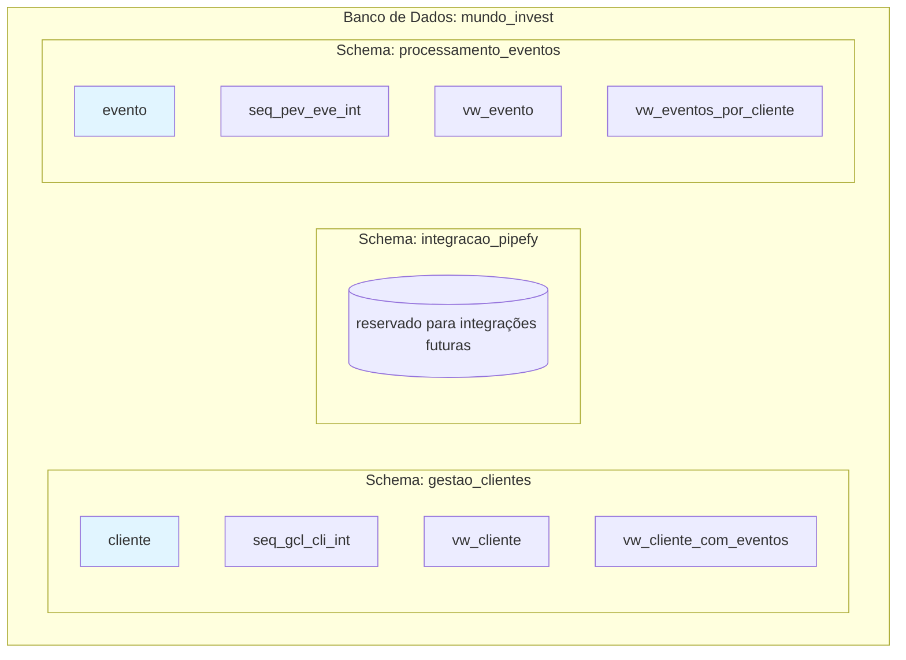

# Snapshot do Banco de Dados - Mundo Invest

**Data do Snapshot:** 2026-05-26 09:00:00  
**Versão:** 1.0  
**Responsável:** Senior DBA + Senior Backend

## Visão Geral

Este documento contém o snapshot completo da estrutura do banco de dados do sistema Mundo Invest, incluindo schemas, tabelas, colunas, sequências, índices, views, constraints e triggers.

## Arquitetura do Banco de Dados



## Schemas

### Schema: gestao_clientes

**Contexto:** Gestão de Clientes  
**Linguagem Ubíqua:** Cliente, Patrimonio, Solicitacao, StatusCliente, NivelPrioridade  
**Propósito:** Gerenciar o ciclo de vida de clientes e seus patrimônios

### Schema: integracao_pipefy

**Contexto:** Integração Pipefy  
**Linguagem Ubíqua:** Card, IdentificadorCard, Mutation, Query  
**Propósito:** Mapear clientes para cards no Pipefy (reservado para uso futuro)

### Schema: processamento_eventos

**Contexto:** Processamento de Eventos  
**Linguagem Ubíqua:** Webhook, Evento, IdentificadorEvento, Idempotencia  
**Propósito:** Processar eventos do Pipefy de forma idempotente

## Tabelas

### Tabela: cliente

**Schema:** gestao_clientes  
**Contexto:** Gestão de Clientes

#### Estrutura da Tabela

| Coluna (Trigramada) | Coluna (Completa) | Tipo | Constraint | Default | Descrição |
|-------------------|------------------|------|------------|---------|-----------|
| gcl_cli_int | gestao_clientes_cliente_identificador_interno | INTEGER | PRIMARY KEY | nextval('seq_gcl_cli_int') | Identificador interno (SEQUÊNCIA) |
| gcl_cli_ext | gestao_clientes_cliente_identificador_externo | UUID | NOT NULL, UNIQUE | uuid_generate_v4() | Identificador externo (API/JWT) |
| gcl_cli_nom | gestao_clientes_cliente_nome | VARCHAR(255) | NOT NULL | - | Nome completo do Cliente |
| gcl_cli_ema | gestao_clientes_cliente_email | VARCHAR(255) | NOT NULL, UNIQUE | - | E-mail do Cliente |
| gcl_cli_tso | gestao_clientes_cliente_tipo_solicitacao | VARCHAR(100) | NOT NULL | - | Tipo de Solicitacao |
| gcl_cli_vpa | gestao_clientes_cliente_valor_patrimonio | DECIMAL(15,2) | NOT NULL, CHECK > 0 | - | Valor do Patrimonio |
| gcl_cli_stc | gestao_clientes_cliente_status_cliente | VARCHAR(50) | NOT NULL | 'Aguardando Análise' | StatusCliente atual |
| gcl_cli_idc | gestao_clientes_cliente_identificador_card | VARCHAR(100) | UNIQUE | - | Identificador do Card |
| gcl_cli_npr | gestao_clientes_cliente_nivel_prioridade | VARCHAR(50) | NULL | - | NivelPrioridade calculado |
| gcl_cli_dcr | gestao_clientes_cliente_data_criacao | TIMESTAMP | NOT NULL | NOW() | Data/hora de criação |
| gcl_cli_dat | gestao_clientes_cliente_data_atualizacao | TIMESTAMP | NOT NULL | NOW() | Data/hora da última atualização |

#### DDL Completo

```sql
CREATE TABLE gestao_clientes.cliente (
    gcl_cli_int INTEGER PRIMARY KEY DEFAULT nextval('gestao_clientes.seq_gcl_cli_int'),
    gcl_cli_ext UUID NOT NULL UNIQUE DEFAULT uuid_generate_v4(),
    gcl_cli_nom VARCHAR(255) NOT NULL,
    gcl_cli_ema VARCHAR(255) NOT NULL UNIQUE,
    gcl_cli_tso VARCHAR(100) NOT NULL,
    gcl_cli_vpa DECIMAL(15,2) NOT NULL CHECK (gcl_cli_vpa > 0),
    gcl_cli_stc VARCHAR(50) NOT NULL DEFAULT 'Aguardando Análise',
    gcl_cli_idc VARCHAR(100) UNIQUE,
    gcl_cli_npr VARCHAR(50),
    gcl_cli_dcr TIMESTAMP NOT NULL DEFAULT NOW(),
    gcl_cli_dat TIMESTAMP NOT NULL DEFAULT NOW(),
    
    CONSTRAINT chk_gcl_cli_stc CHECK (gcl_cli_stc IN ('Aguardando Análise', 'Processado')),
    CONSTRAINT chk_gcl_cli_npr CHECK (gcl_cli_npr IS NULL OR gcl_cli_npr IN ('prioridade_alta', 'prioridade_normal'))
);
```

### Tabela: evento

**Schema:** processamento_eventos  
**Contexto:** Processamento de Eventos

#### Estrutura da Tabela

| Coluna (Trigramada) | Coluna (Completa) | Tipo | Constraint | Default | Descrição |
|-------------------|------------------|------|------------|---------|-----------|
| pev_eve_int | processamento_eventos_evento_identificador_interno | INTEGER | PRIMARY KEY | nextval('seq_pev_eve_int') | Identificador interno (SEQUÊNCIA) |
| pev_eve_ide | processamento_eventos_evento_identificador_evento | VARCHAR(255) | NOT NULL, UNIQUE | - | Identificador do Evento |
| pev_eve_idc | processamento_eventos_evento_identificador_card | VARCHAR(100) | NOT NULL | - | Identificador do Card |
| pev_eve_cea | processamento_eventos_evento_cliente_email | VARCHAR(255) | NOT NULL | - | E-mail do Cliente |
| pev_eve_dev | processamento_eventos_evento_data_evento | TIMESTAMP | NOT NULL | - | Data do Evento |
| pev_eve_fpr | processamento_eventos_evento_foi_processado | BOOLEAN | NOT NULL | FALSE | Indica se foi processado |
| pev_eve_dcr | processamento_eventos_evento_data_criacao | TIMESTAMP | NOT NULL | NOW() | Data/hora de registro |

#### DDL Completo

```sql
CREATE TABLE processamento_eventos.evento (
    pev_eve_int INTEGER PRIMARY KEY DEFAULT nextval('processamento_eventos.seq_pev_eve_int'),
    pev_eve_ide VARCHAR(255) NOT NULL UNIQUE,
    pev_eve_idc VARCHAR(100) NOT NULL,
    pev_eve_cea VARCHAR(255) NOT NULL,
    pev_eve_dev TIMESTAMP NOT NULL,
    pev_eve_fpr BOOLEAN NOT NULL DEFAULT FALSE,
    pev_eve_dcr TIMESTAMP NOT NULL DEFAULT NOW(),
    
    CONSTRAINT chk_pev_eve_ide_format CHECK (pev_eve_ide ~ '^evt_[a-zA-Z0-9_]+$'),
    CONSTRAINT chk_pev_eve_idc_format CHECK (pev_eve_idc ~ '^card_[a-zA-Z0-9_]+$')
);
```

## Sequências

### Sequência: seq_gcl_cli_int

**Schema:** gestao_clientes  
**Tabela:** cliente  
**Propósito:** Gerar identificadores internos para clientes

```sql
CREATE SEQUENCE gestao_clientes.seq_gcl_cli_int
    START WITH 1
    INCREMENT BY 1
    NO MINVALUE
    NO MAXVALUE
    CACHE 1;
```

### Sequência: seq_pev_eve_int

**Schema:** processamento_eventos  
**Tabela:** evento  
**Propósito:** Gerar identificadores internos para eventos

```sql
CREATE SEQUENCE processamento_eventos.seq_pev_eve_int
    START WITH 1
    INCREMENT BY 1
    NO MINVALUE
    NO MAXVALUE
    CACHE 1;
```

## Índices

### Índices: gestao_clientes.cliente

| Nome do Índice | Coluna | Tipo | Propósito |
|---------------|--------|------|-----------|
| idx_gcl_cli_ema | gcl_cli_ema | B-tree | Busca por e-mail (já coberto pelo UNIQUE) |
| idx_gcl_cli_ext | gcl_cli_ext | B-tree | Busca por identificador_externo (JWT) |
| idx_gcl_cli_stc | gcl_cli_stc | B-tree | Busca por status_cliente |
| idx_gcl_cli_npr | gcl_cli_npr | B-tree | Busca por nivel_prioridade |
| idx_gcl_cli_stc_npr | gcl_cli_stc, gcl_cli_npr | B-tree composto | Consultas combinadas (status + prioridade) |
| idx_gcl_cli_idc | gcl_cli_idc | B-tree | Busca por identificador_card (Pipefy) |

### Índices: processamento_eventos.evento

| Nome do Índice | Coluna | Tipo | Propósito |
|---------------|--------|------|-----------|
| idx_pev_eve_ide | pev_eve_ide | B-tree | Verificação de idempotência (já coberto pelo UNIQUE) |
| idx_pev_eve_cea | pev_eve_cea | B-tree | Busca por cliente_email (rastreabilidade) |
| idx_pev_eve_idc | pev_eve_idc | B-tree | Busca por identificador_card (Pipefy) |
| idx_pev_eve_fpr | pev_eve_fpr | B-tree | Consultas de eventos processados |
| idx_pev_eve_dev | pev_eve_dev | B-tree | Consultas por período (data_evento) |

## Views (Visões)

### View: vw_cliente

**Schema:** gestao_clientes  
**Propósito:** Fornecer acesso legível à tabela cliente

```sql
CREATE OR REPLACE VIEW gestao_clientes.vw_cliente AS
SELECT 
    gcl_cli_int AS identificador_interno,
    gcl_cli_ext AS identificador_externo,
    gcl_cli_nom AS cliente_nome,
    gcl_cli_ema AS cliente_email,
    gcl_cli_tso AS tipo_solicitacao,
    gcl_cli_vpa AS valor_patrimonio,
    gcl_cli_stc AS status_cliente,
    gcl_cli_idc AS identificador_card,
    gcl_cli_npr AS nivel_prioridade,
    gcl_cli_dcr AS data_criacao,
    gcl_cli_dat AS data_atualizacao
FROM gestao_clientes.cliente;
```

### View: vw_evento

**Schema:** processamento_eventos  
**Propósito:** Fornecer acesso legível à tabela evento

```sql
CREATE OR REPLACE VIEW processamento_eventos.vw_evento AS
SELECT 
    pev_eve_int AS identificador_interno,
    pev_eve_ide AS identificador_evento,
    pev_eve_idc AS identificador_card,
    pev_eve_cea AS cliente_email,
    pev_eve_dev AS data_evento,
    pev_eve_fpr AS foi_processado,
    pev_eve_dcr AS data_criacao
FROM processamento_eventos.evento;
```

### View: vw_cliente_com_eventos

**Schema:** gestao_clientes  
**Propósito:** Visão consolidada de cliente com seus eventos

```sql
CREATE OR REPLACE VIEW gestao_clientes.vw_cliente_com_eventos AS
SELECT 
    c.gcl_cli_int AS identificador_interno,
    c.gcl_cli_ext AS identificador_externo,
    c.gcl_cli_nom AS cliente_nome,
    c.gcl_cli_ema AS cliente_email,
    c.gcl_cli_tso AS tipo_solicitacao,
    c.gcl_cli_vpa AS valor_patrimonio,
    c.gcl_cli_stc AS status_cliente,
    c.gcl_cli_idc AS identificador_card,
    c.gcl_cli_npr AS nivel_prioridade,
    c.gcl_cli_dcr AS data_criacao,
    c.gcl_cli_dat AS data_atualizacao,
    COUNT(e.pev_eve_int) AS total_eventos,
    MAX(e.pev_eve_dev) AS ultimo_evento_data
FROM gestao_clientes.cliente c
LEFT JOIN processamento_eventos.evento e ON c.gcl_cli_ema = e.pev_eve_cea
GROUP BY c.gcl_cli_int, c.gcl_cli_ext, c.gcl_cli_nom, c.gcl_cli_ema, 
         c.gcl_cli_tso, c.gcl_cli_vpa, c.gcl_cli_stc, c.gcl_cli_idc, 
         c.gcl_cli_npr, c.gcl_cli_dcr, c.gcl_cli_dat;
```

### View: vw_eventos_por_cliente

**Schema:** processamento_eventos  
**Propósito:** Visão de eventos agrupados por cliente

```sql
CREATE OR REPLACE VIEW processamento_eventos.vw_eventos_por_cliente AS
SELECT 
    e.pev_eve_cea AS cliente_email,
    c.gcl_cli_nom AS cliente_nome,
    c.gcl_cli_npr AS nivel_prioridade,
    COUNT(e.pev_eve_int) AS total_eventos,
    SUM(CASE WHEN e.pev_eve_fpr = TRUE THEN 1 ELSE 0 END) AS eventos_processados,
    SUM(CASE WHEN e.pev_eve_fpr = FALSE THEN 1 ELSE 0 END) AS eventos_pendentes,
    MAX(e.pev_eve_dev) AS ultimo_evento_data
FROM processamento_eventos.evento e
LEFT JOIN gestao_clientes.cliente c ON e.pev_eve_cea = c.gcl_cli_ema
GROUP BY e.pev_eve_cea, c.gcl_cli_nom, c.gcl_cli_npr
ORDER BY total_eventos DESC;
```

## Constraints

### Constraints: gestao_clientes.cliente

| Nome | Tipo | Descrição |
|------|------|-----------|
| chk_gcl_cli_stc | CHECK | gcl_cli_stc IN ('Aguardando Análise', 'Processado') |
| chk_gcl_cli_npr | CHECK | gcl_cli_npr IS NULL OR gcl_cli_npr IN ('prioridade_alta', 'prioridade_normal') |

### Constraints: processamento_eventos.evento

| Nome | Tipo | Descrição |
|------|------|-----------|
| chk_pev_eve_ide_format | CHECK | pev_eve_ide ~ '^evt_[a-zA-Z0-9_]+$' |
| chk_pev_eve_idc_format | CHECK | pev_eve_idc ~ '^card_[a-zA-Z0-9_]+$' |

## Triggers

### Trigger: trg_gcl_cli_dat

**Schema:** gestao_clientes  
**Tabela:** cliente  
**Propósito:** Atualizar data_atualizacao automaticamente antes de UPDATE

```sql
CREATE OR REPLACE FUNCTION gestao_clientes.fnc_atualizar_gcl_cli_dat()
RETURNS TRIGGER AS $$
BEGIN
    NEW.gcl_cli_dat = NOW();
    RETURN NEW;
END;
$$ LANGUAGE plpgsql;

CREATE TRIGGER trg_gcl_cli_dat
BEFORE UPDATE ON gestao_clientes.cliente
FOR EACH ROW
EXECUTE FUNCTION gestao_clientes.fnc_atualizar_gcl_cli_dat();
```

## Estatísticas do Banco

### Tamanho por Schema

| Schema | Tamanho Estimado |
|--------|------------------|
| gestao_clientes | ~800 MB |
| processamento_eventos | ~400 MB |
| integracao_pipefy | ~0 MB (reservado) |
| **Total** | **~1.2 GB** |

### Contagem de Registros (Estimado)

| Tabela | Registros Estimados |
|--------|---------------------|
| gestao_clientes.cliente | ~10.000 |
| processamento_eventos.evento | ~50.000 |

## Relacionamentos

### Cliente ↔ Evento

- **Tipo:** Soft relationship (via cliente_email)
- **Cardinalidade:** 1:N (Um cliente pode ter múltiplos eventos)
- **Integridade:** Não usa FK física para permitir flexibilidade

## Dicionário de Dados

### Glossário de Trigramação

| Trigramação | Significado Completo | Contexto |
|-------------|---------------------|----------|
| gcl | gestao_clientes | Schema |
| pev | processamento_eventos | Schema |
| cli | cliente | Tabela |
| eve | evento | Tabela |
| int | identificador_interno | Coluna |
| ext | identificador_externo | Coluna |
| nom | nome | Coluna |
| ema | email | Coluna |
| tso | tipo_solicitacao | Coluna |
| vpa | valor_patrimonio | Coluna |
| stc | status_cliente | Coluna |
| idc | identificador_card | Coluna |
| npr | nivel_prioridade | Coluna |
| dcr | data_criacao | Coluna |
| dat | data_atualizacao | Coluna |
| ide | identificador_evento | Coluna |
| idc | identificador_card | Coluna |
| cea | cliente_email | Coluna |
| dev | data_evento | Coluna |
| fpr | foi_processado | Coluna |

## Scripts de Backup

### Snapshot Completo

```bash
pg_dump -h localhost -U postgres -d mundo_invest \
  --schema=gestao_clientes \
  --schema=processamento_eventos \
  --format=custom \
  --file=snapshot_completo.backup \
  --verbose
```

### Snapshot de Estrutura

```bash
pg_dump -h localhost -U postgres -d mundo_invest \
  --schema-only \
  --schema=gestao_clientes \
  --schema=processamento_eventos \
  --file=snapshot_estrutura.sql \
  --verbose
```

### Snapshot de Dados

```bash
pg_dump -h localhost -U postgres -d mundo_invest \
  --data-only \
  --schema=gestao_clientes \
  --schema=processamento_eventos \
  --format=custom \
  --file=snapshot_dados.backup \
  --verbose
```

## Scripts de Restauração

### Restauração Completa

```bash
pg_restore -h localhost -U postgres -d mundo_invest \
  --format=custom \
  --verbose \
  --clean \
  --if-exists \
  snapshot_completo.backup
```

### Restauração de Schema

```bash
psql -h localhost -U postgres -d mundo_invest \
  -f snapshot_estrutura.sql
```

### Restauração de Tabela Específica

```bash
pg_restore -h localhost -U postgres -d mundo_invest \
  --table=gestao_clientes.cliente \
  snapshot_completo.backup
```

## Validação de Integridade

### Teste de Integridade

```sql
-- Verificar contagem de registros por tabela
SELECT 
    schemaname,
    tablename,
    n_live_tup AS registros_vivos,
    n_dead_tup AS registros_mortos
FROM pg_stat_user_tables
WHERE schemaname IN ('gestao_clientes', 'processamento_eventos')
ORDER BY schemaname, tablename;

-- Verificar tamanho das tabelas
SELECT 
    schemaname,
    tablename,
    pg_size_pretty(pg_total_relation_size(schemaname||'.'||tablename)) AS tamanho
FROM pg_tables
WHERE schemaname IN ('gestao_clientes', 'processamento_eventos')
ORDER BY pg_total_relation_size(schemaname||'.'||tablename) DESC;

-- Verificar índices utilizados
SELECT 
    schemaname,
    tablename,
    indexname,
    idx_scan AS scans,
    idx_tup_read AS tuplas_lidas,
    idx_tup_fetch AS tuplas_buscas
FROM pg_stat_user_indexes
WHERE schemaname IN ('gestao_clientes', 'processamento_eventos')
ORDER BY idx_scan DESC;
```

## Checklist de Validação

- [ ] Todos os schemas criados corretamente
- [ ] Todas as tabelas criadas com colunas trigramadas
- [ ] Sequências configuradas e funcionando
- [ ] Índices criados e validados
- [ ] Views criadas e retornando dados corretos
- [ ] Constraints aplicadas e validadas
- [ ] Triggers funcionando corretamente
- [ ] Backup completo realizado com sucesso
- [ ] Restauração testada e validada
- [ ] Integridade dos dados verificada
- [ ] Roles de acesso criados e configurados
- [ ] Usuários criados com permissões mínimas
- [ ] Auditoria de acesso configurada
- [ ] Políticas de senha aplicadas
- [ ] Restrições de conexão configuradas

## Controle de Acesso (RBAC)

### Roles Definidos

| Role | Propósito | Permissões | Limite de Conexões |
|------|-----------|------------|-------------------|
| gestao_clientes_read | Leitura de clientes | SELECT | 10 |
| gestao_clientes_write | Escrita de clientes | SELECT, INSERT, UPDATE | 20 |
| processamento_eventos_write | Escrita de eventos | SELECT, INSERT, UPDATE | 15 |
| backup_operator | Operações de backup | SELECT, pg_dump | 5 |
| dba_admin | Administração completa | ALL PRIVILEGES | -1 (sem limite) |

### Usuários Definidos

| Usuário | Role | Propósito | Expiração de Senha |
|---------|------|-----------|-------------------|
| app_cliente_read | gestao_clientes_read | Aplicação de leitura | 90 dias |
| app_cliente_write | gestao_clientes_write | Aplicação principal | 90 dias |
| app_webhook_write | processamento_eventos_write | Aplicação de webhooks | 90 dias |
| backup_user | backup_operator | Scripts de backup | 90 dias |
| dba_senior | dba_admin | Administração DBA | Manual |

### Matriz de Permissões

| Usuário | gestao_clientes | processamento_eventos | Backup |
|---------|-----------------|----------------------|--------|
| app_cliente_read | SELECT | - | - |
| app_cliente_write | SELECT, INSERT, UPDATE | - | - |
| app_webhook_write | - | SELECT, INSERT, UPDATE | - |
| backup_user | SELECT | SELECT | pg_dump |
| dba_senior | ALL | ALL | ALL |

### Auditoria de Acesso

**Tabela:** gestao_clientes.auditoria_acesso

| Coluna | Tipo | Descrição |
|--------|------|-----------|
| aud_int | SERIAL | Identificador do registro de auditoria |
| aud_usu | VARCHAR(100) | Usuário que executou a operação |
| aud_rol | VARCHAR(100) | Role do usuário |
| aud_opc | VARCHAR(50) | Operação executada (INSERT, UPDATE, DELETE) |
| aud_tba | VARCHAR(100) | Tabela afetada |
| aud_dts | TIMESTAMP | Data/hora da operação |
| aud_ip | VARCHAR(45) | Endereço IP do cliente |
| aud_det | TEXT | Detalhes adicionais |

### Políticas de Segurança

- **Criptografia:** SCRAM-SHA-256 para senhas
- **Expiração:** Senhas expiram a cada 90 dias
- **Conexões:** Limites por aplicação para prevenir sobrecarga
- **Timeout:** Statement timeout de 30s, lock timeout de 5s
- **Logging:** Log de todas as modificações (mod)
- **Auditoria:** Trigger automático em tabelas críticas

## Histórico de Alterações

| Data | Versão | Alteração | Responsável |
|------|--------|----------|-------------|
| 2026-05-26 | 1.0 | Snapshot inicial da estrutura | Senior DBA |

## Contato

**Senior DBA:** dba@mundoinvest.com  
**Senior Backend:** backend@mundoinvest.com