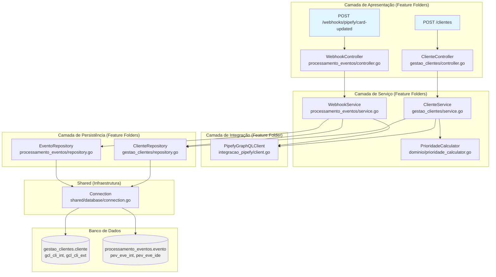
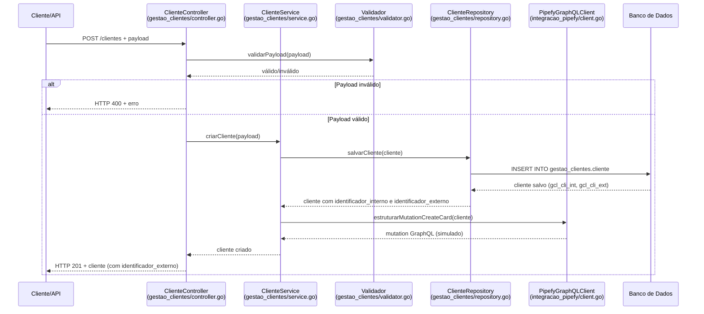
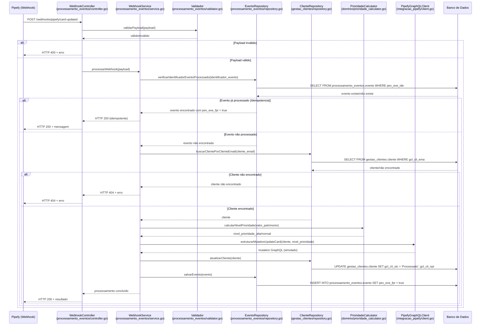
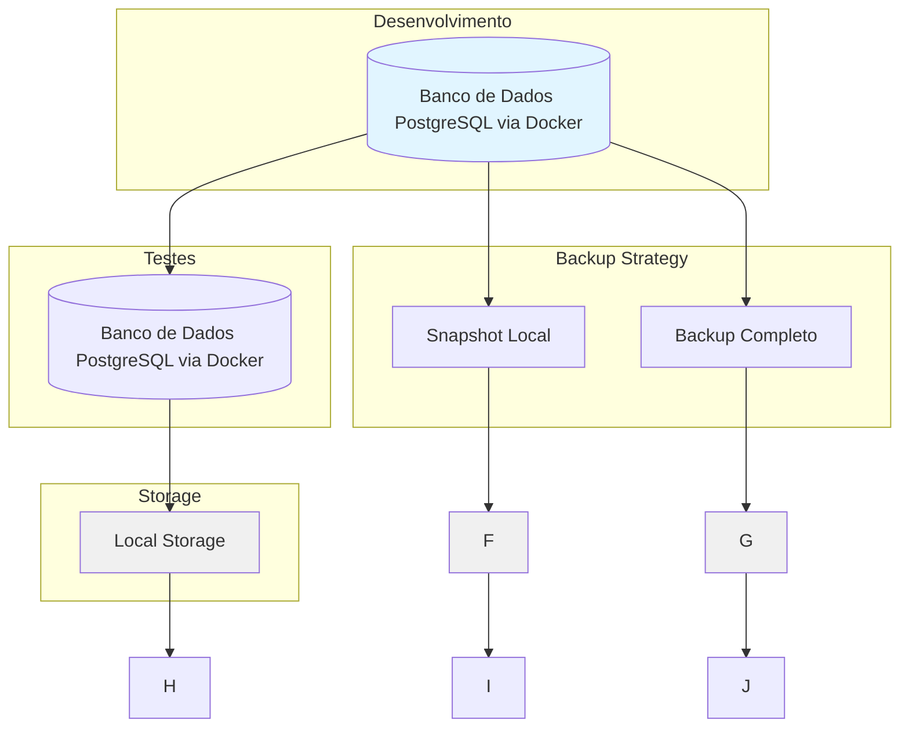

# Plano de Implementação - Mundo Invest

## Visão Geral

Este plano detalha a implementação do sistema de gestão de clientes e integração com Pipefy para o Mundo Invest, seguindo os princípios de Domain-Driven Design (DDD), normalização de dados (3NF) e linguagem ubíqua do domínio.

## Contextos Delimitados

O sistema está organizado em três contextos delimitados:

### 1. Contexto: Gestão de Clientes
- **Linguagem Ubíqua:** Cliente, Patrimonio, Solicitacao, StatusCliente, NivelPrioridade
- **Responsabilidade:** Gerenciar o ciclo de vida de clientes e seus patrimônios

### 2. Contexto: Integração Pipefy
- **Linguagem Ubíqua:** Card, IdentificadorCard, Mutation, Query
- **Responsabilidade:** Mapear clientes para cards no Pipefy

### 3. Contexto: Processamento de Eventos
- **Linguagem Ubíqua:** Webhook, Evento, IdentificadorEvento, Idempotencia
- **Responsabilidade:** Processar eventos do Pipefy de forma idempotente

## Cenários Identificados

### Criação de Cliente (POST /clientes)

#### Cenários de Sucesso:
- ✅ Criar cliente com dados válidos
- ✅ Cliente salvo com status "Aguardando Análise"
- ✅ Card_id gerado e mutation createCard estruturada

#### Cenários de Falha:
- ❌ Criar cliente sem campos obrigatórios (nome, email, tipo_solicitacao, valor_patrimonio)
- ❌ Criar cliente com erro de banco de dados

#### Cenários de Validação:
- ⚠️ Criar cliente com e-mail inválido
- ⚠️ Criar cliente com patrimônio negativo
- ⚠️ Criar cliente com patrimônio zero
- ⚠️ Criar cliente com nome vazio

### Webhook Card Updated (POST /webhooks/pipefy/card-updated)

#### Cenários de Sucesso:
- ✅ Processar webhook com patrimônio alto (>= 200.000) → prioridade_alta
- ✅ Processar webhook com patrimônio baixo (< 200.000) → prioridade_normal
- ✅ Processar webhook com patrimônio no limite (== 200.000) → prioridade_alta
- ✅ Processar webhook duplicado (idempotência)

#### Cenários de Falha:
- ❌ Processar webhook com cliente não encontrado
- ❌ Processar webhook com erro de banco de dados

#### Cenários de Validação:
- ⚠️ Processar webhook sem campos obrigatórios (event_id, card_id, cliente_email, timestamp)
- ⚠️ Processar webhook com event_id vazio
- ⚠️ Processar webhook com card_id vazio
- ⚠️ Processar webhook com cliente_email vazio
- ⚠️ Processar webhook com cliente_email inválido
- ⚠️ Processar webhook com timestamp inválido

**Total de Cenários:** 22 cenários cobrindo todos os aspectos de sucesso, falha e validação.

### Arquitetura Proposta (Feature Folders)



## Fluxo 1: Criação de Cliente



## Fluxo 2: Processamento de Webhook



## Cronograma Ágil (Sprints)

### Sprint 1: Fundamentos e Estrutura (2 dias)

**Objetivo**: Configurar estrutura do projeto e banco de dados seguindo DDD e normalização

#### Tarefas:

1. **Configuração do Projeto**
   - [ ] Escolher linguagem (Golang ou Python)
   - [ ] Inicializar projeto com dependências básicas
   - [ ] Configurar estrutura de pastas seguindo Feature Folders (DDD + contextos delimitados)
   - [ ] Criar estrutura: cmd/server/, internal/gestao_clientes/, internal/integracao_pipefy/, internal/processamento_eventos/, internal/dominio/, internal/shared/, pkg/validation/
   - [ ] Configurar PostgreSQL via Docker (desenvolvimento e testes)
   - [ ] Criar docker-compose.yml com serviço PostgreSQL
   - [ ] Criar pasta migrations com versionamento

2. **Modelo de Dados (3FN + Linguagem Ubíqua + Trigramação)**
   - [ ] Criar schemas por contexto delimitado (gestao_clientes, integracao_pipefy, processamento_eventos)
   - [ ] Criar sequências SQL para identificadores internos (seq_gcl_cli_int, seq_pev_eve_int)
   - [ ] Criar entidade Cliente com colunas trigramadas (gcl_cli_int, gcl_cli_ext, gcl_cli_nom, etc.)
   - [ ] Criar entidade Evento com colunas trigramadas (pev_eve_int, pev_eve_ide, pev_eve_idc, etc.)
   - [ ] Criar migrations com nomenclatura descritiva (001_criar_schemas.sql, etc.)
   - [ ] Criar views para acesso legível (vw_cliente, vw_evento, etc.)
   - [ ] Configurar índices (gcl_cli_ema único, pev_eve_ide único)

3. **Camada de Persistência (Feature Folders)**
   - [ ] Implementar internal/gestao_clientes/repository.go com ClienteRepository: salvar, buscarPorIdentificadorInterno, buscarPorClienteEmail, buscarPorIdentificadorExterno, atualizar
   - [ ] Implementar internal/processamento_eventos/repository.go com EventoRepository: salvar, buscarPorIdentificadorEvento, verificarFoiProcessado
   - [ ] Implementar internal/shared/database/connection.go para gerenciar conexões
   - [ ] Implementar transações atômicas

4. **Segurança do Banco de Dados (RBAC)**
   - [ ] Criar roles de acesso (gestao_clientes_read, gestao_clientes_write, processamento_eventos_write, backup_operator, dba_admin)
   - [ ] Criar usuários específicos (app_cliente_read, app_cliente_write, app_webhook_write, backup_user, dba_senior)
   - [ ] Configurar permissões mínimas por role (princípio do menor privilégio)
   - [ ] Configurar limites de conexão por aplicação
   - [ ] Implementar auditoria de acesso com triggers
   - [ ] Configurar políticas de senha (SCRAM-SHA-256, expiração 90 dias)
   - [ ] Configurar logging de consultas (mod)

#### Critérios de Aceite:
- [ ] Projeto compila sem erros
- [ ] Docker Compose inicia PostgreSQL corretamente
- [ ] Banco de dados é criado e acessível via Docker
- [ ] Schemas por contexto delimitado criados (gestao_clientes, processamento_eventos)
- [ ] Sequências SQL funcionando corretamente
- [ ] Tabelas seguem nomenclatura de trigramação
- [ ] Views criadas para acesso legível
- [ ] Migrations funcionam corretamente
- [ ] Repositórios conseguem realizar operações CRUD básicas
- [ ] Roles e usuários criados com permissões mínimas
- [ ] Auditoria de acesso configurada e funcionando
- [ ] Políticas de senha aplicadas
- [ ] Limites de conexão configurados

### docker-compose.yml

```yaml
version: '3.8'

services:
  postgres:
    image: postgres:15-alpine
    container_name: postgres_container
    environment:
      POSTGRES_DB: mundo_invest
      POSTGRES_USER: postgres
      POSTGRES_PASSWORD: postgres
    ports:
      - "5432:5432"
    volumes:
      - postgres_data:/var/lib/postgresql/data
      - ./migrations:/docker-entrypoint-initdb.d
    healthcheck:
      test: ["CMD-SHELL", "pg_isready -U postgres"]
      interval: 10s
      timeout: 5s
      retries: 5

volumes:
  postgres_data:
```

**Instruções de Uso:**
- `docker-compose up -d` - Iniciar PostgreSQL em background
- `docker-compose down` - Parar e remover containers
- `docker-compose logs postgres` - Ver logs do PostgreSQL
- `docker exec -it postgres_container psql -U postgres -d mundo_invest` - Acessar banco via psql

### Sprint 2: API de Criação de Cliente (2 dias)

**Objetivo**: Implementar endpoint POST /clientes seguindo linguagem ubíqua

#### Tarefas:

1. **Validação de Dados (Feature Folder: gestao_clientes)**
   - [ ] Implementar internal/gestao_clientes/validator.go com validador de payload de cliente
   - [ ] Validar campos obrigatórios (cliente_nome, cliente_email, tipo_solicitacao, valor_patrimonio)
   - [ ] Validar formato de cliente_email
   - [ ] Validar valor_patrimonio positivo
   - [ ] Criar mensagens de erro em Português

2. **Camada de Serviço (Feature Folder: gestao_clientes)**
   - [ ] Implementar internal/gestao_clientes/service.go com ClienteService.criarCliente()
   - [ ] Implementar lógica de status_cliente inicial "Aguardando Análise"
   - [ ] Implementar geração de identificador_card simulado
   - [ ] Implementar regras de negócio de criação

3. **Camada de Apresentação (Feature Folder: gestao_clientes)**
   - [ ] Implementar internal/gestao_clientes/controller.go com ClienteController
   - [ ] Criar endpoint POST /clientes
   - [ ] Implementar parsing de JSON
   - [ ] Implementar respostas HTTP (201, 400)

4. **Integração Pipefy (Feature Folder: integracao_pipefy)**
   - [ ] Pesquisar documentação oficial do Pipefy para createCard
   - [ ] Implementar internal/integracao_pipefy/client.go com PipefyGraphQLClient
   - [ ] Implementar internal/integracao_pipefy/mutations.go com createCard
   - [ ] Estruturar mutation createCard conforme especificação
   - [ ] Adicionar comentários com fonte da especificação
   - [ ] Simular envio (sem requisição real)

#### Critérios de Aceite:
- [ ] Endpoint POST /clientes responde a requisições
- [ ] Cliente válido é salvo no banco com status_cliente correto
- [ ] Payload inválido retorna HTTP 400
- [ ] Mutation createCard está estruturada no código
- [ ] Nomenclatura segue linguagem ubíqua
- [ ] Testes manuais passam

### Sprint 3: API de Webhook (2 dias)

**Objetivo**: Implementar endpoint POST /webhooks/pipefy/card-updated seguindo linguagem ubíqua

#### Tarefas:

1. **Validação de Dados (Feature Folder: processamento_eventos)**
   - [ ] Implementar internal/processamento_eventos/validator.go com validador de payload de webhook
   - [ ] Validar campos obrigatórios (identificador_evento, identificador_card, cliente_email, data_evento)
   - [ ] Validar formato de cliente_email
   - [ ] Criar mensagens de erro em Português

2. **Camada de Serviço (Feature Folder: processamento_eventos)**
   - [ ] Implementar internal/processamento_eventos/service.go com WebhookService.processarWebhook()
   - [ ] Implementar verificação de idempotencia por identificador_evento
   - [ ] Implementar busca de cliente por cliente_email
   - [ ] Implementar tratamento de cliente não encontrado

3. **Cálculo de Prioridade (Feature Folder: dominio)**
   - [ ] Implementar internal/dominio/prioridade_calculator.go com PrioridadeCalculator
   - [ ] Implementar regra: valor_patrimonio >= 200.000 → nivel_prioridade_alta
   - [ ] Implementar regra: valor_patrimonio < 200.000 → nivel_prioridade_normal
   - [ ] Implementar regra: valor_patrimonio == 200.000 → nivel_prioridade_alta

4. **Atualização de Cliente (Feature Folder: processamento_eventos)**
   - [ ] Implementar atualização de status_cliente para "Processado"
   - [ ] Implementar salvamento de nivel_prioridade calculado
   - [ ] Implementar persistência de evento com foi_processado

5. **Integração Pipefy (Feature Folder: integracao_pipefy)**
   - [ ] Pesquisar documentação oficial do Pipefy para updateCard
   - [ ] Implementar internal/integracao_pipefy/mutations.go com updateCard
   - [ ] Estruturar mutation updateCard conforme especificação
   - [ ] Adicionar comentários com fonte da especificação
   - [ ] Simular envio (sem requisição real)

6. **Camada de Apresentação (Feature Folder: processamento_eventos)**
   - [ ] Implementar internal/processamento_eventos/controller.go com WebhookController
   - [ ] Criar endpoint POST /webhooks/pipefy/card-updated
   - [ ] Implementar parsing de JSON
   - [ ] Implementar respostas HTTP (200, 400, 404)

#### Critérios de Aceite:
- [ ] Endpoint POST /webhooks/pipefy/card-updated responde a requisições
- [ ] Webhook válido processa cliente corretamente
- [ ] NivelPrioridade é calculado corretamente
- [ ] Idempotencia funciona (identificador_evento duplicado não reprocessa)
- [ ] Cliente não encontrado retorna HTTP 404
- [ ] Mutation updateCard está estruturada no código
- [ ] Nomenclatura segue linguagem ubíqua
- [ ] Testes manuais passam

### Sprint 4: Testes Automatizados (2 dias)

**Objetivo**: Implementar testes automatizados cobrindo todos os cenários

#### Tarefas:

1. **Testes de Criação de Cliente (Feature Folder: gestao_clientes)**
   - [ ] Criar internal/gestao_clientes/controller_test.go com testes do ClienteController
   - [ ] Teste: criação com payload válido
   - [ ] Teste: validação de campos obrigatórios (nome)
   - [ ] Teste: validação de campos obrigatórios (email)
   - [ ] Teste: validação de campos obrigatórios (tipo_solicitacao)
   - [ ] Teste: validação de campos obrigatórios (valor_patrimonio)
   - [ ] Teste: validação de e-mail inválido
   - [ ] Teste: validação de patrimônio negativo
   - [ ] Teste: validação de patrimônio zero
   - [ ] Teste: validação de nome vazio
   - [ ] Teste: erro de banco de dados

2. **Testes de Webhook (Feature Folder: processamento_eventos)**
   - [ ] Criar internal/processamento_eventos/controller_test.go com testes do WebhookController
   - [ ] Teste: processamento com prioridade alta (patrimonio >= 200.000)
   - [ ] Teste: processamento com prioridade normal (patrimonio < 200.000)
   - [ ] Teste: processamento no limite (patrimonio == 200.000)
   - [ ] Teste: idempotência (event_id duplicado)
   - [ ] Teste: cliente não encontrado
   - [ ] Teste: validação de campos obrigatórios (event_id)
   - [ ] Teste: validação de campos obrigatórios (card_id)
   - [ ] Teste: validação de campos obrigatórios (cliente_email)
   - [ ] Teste: validação de campos obrigatórios (timestamp)
   - [ ] Teste: validação de event_id vazio
   - [ ] Teste: validação de card_id vazio
   - [ ] Teste: validação de cliente_email vazio
   - [ ] Teste: validação de email inválido
   - [ ] Teste: validação de timestamp inválido
   - [ ] Teste: erro de banco de dados

3. **Testes de Integração (Feature Folder: shared)**
   - [ ] Criar internal/shared/database/connection_test.go com testes de integração
   - [ ] Teste: integração com banco de dados
   - [ ] Teste: transações atômicas
   - [ ] Teste: restrições de unicidade

#### Critérios de Aceite:
- [ ] Todos os 22 cenários de teste passam
- [ ] Cobertura de testes > 80%
- [ ] Testes rodam em pipeline CI/CD

### Sprint 5: Documentação e Finalização (1 dia)

**Objetivo**: Preparar documentação e README para entrega

#### Tarefas:

1. **README.md**
   - [ ] Instruções de execução local do projeto
   - [ ] Instruções de execução dos testes
   - [ ] Instruções para rodar PostgreSQL via Docker
   - [ ] Exemplos de requisição curl para POST /clientes
   - [ ] Exemplos de requisição curl para POST /webhooks/pipefy/card-updated

2. **Documentação Técnica**
   - [ ] Atualizar regras de negócio se necessário
   - [ ] Atualizar requisitos funcionais se necessário
   - [ ] Documentar estrutura de pastas Feature Folders (contextos delimitados)
   - [ ] Documentar mapeamento de arquivos por contexto (gestao_clientes, integracao_pipefy, processamento_eventos, dominio, shared)
   - [ ] Documentar mutations GraphQL com referências

3. **Preparação para Defesa**
   - [ ] Preparar script de apresentação
   - [ ] Identificar pontos altos do código (mutations GraphQL)
   - [ ] Verificar estrutura de pastas para explicação

#### Critérios de Aceite:
- [ ] README.md completo e funcional
- [ ] Projeto pode ser executado seguindo README
- [ ] Testes podem ser executados seguindo README
- [ ] Exemplos de curl funcionam

## Estrutura de Pastas (Feature Folders)

Estrutura baseada em Feature Folders, organizada por contextos delimitados (DDD):

```
MundoInvest/
├── cmd/
│   └── server/
│       └── main.go
├── internal/
│   ├── gestao_clientes/
│   │   ├── controller.go          # ClienteController
│   │   ├── service.go             # ClienteService
│   │   ├── repository.go          # ClienteRepository
│   │   ├── model.go               # Cliente struct
│   │   ├── validator.go           # Validador de payload
│   │   └── dto.go                 # Request/Response DTOs
│   ├── integracao_pipefy/
│   │   ├── client.go              # PipefyGraphQLClient
│   │   ├── mutations.go           # createCard, updateCard
│   │   └── queries.go             # Queries GraphQL
│   ├── processamento_eventos/
│   │   ├── controller.go          # WebhookController
│   │   ├── service.go             # WebhookService
│   │   ├── repository.go          # EventoRepository
│   │   ├── model.go               # Evento struct
│   │   └── validator.go           # Validador de webhook
│   ├── dominio/
│   │   └── prioridade_calculator.go  # Lógica de prioridade
│   └── shared/
│       ├── database/
│       │   └── connection.go
│       └── middleware/
│           └── logging.go
├── pkg/
│   └── validation/
│       └── validator.go
├── docker-compose.yml
├── migrations/
│   ├── 001_criar_schemas.sql
│   ├── 002_criar_sequencia_cliente.sql
│   ├── 003_criar_tabela_cliente.sql
│   ├── 004_criar_sequencia_evento.sql
│   ├── 005_criar_tabela_evento.sql
│   ├── 006_criar_indices_cliente.sql
│   ├── 007_criar_indices_evento.sql
│   ├── 008_criar_constraints_cliente.sql
│   ├── 009_criar_constraints_evento.sql
│   ├── 010_criar_triggers_cliente.sql
│   ├── 011_criar_view_cliente.sql
│   ├── 012_criar_view_evento.sql
│   ├── 013_criar_view_cliente_com_eventos.sql
│   ├── 014_criar_view_eventos_por_cliente.sql
│   ├── 015_criar_roles_usuarios.sql
│   └── 016_configurar_auditoria.sql
├── bdd/
│   ├── criacao-cliente/
│   │   ├── sucesso.md
│   │   ├── falha.md
│   │   └── validacao.md
│   └── webhook-card-updated/
│       ├── sucesso.md
│       ├── falha.md
│       └── validacao.md
├── docs/
│   ├── regras-negocio.md
│   ├── requisitos-funcionais.md
│   ├── modelagem-dados.md
│   ├── snapshot-banco-dados.md
│   └── documentacao.md
├── planos/
│   ├── plano-implementacao.md
│   └── resumo-executivo.md
├── go.mod
└── README.md
```

### Vantagens do Feature Folder

**Coesão:** Todo código relacionado a um contexto está junto
- `internal/gestao_clientes/` contém todo o código do contexto de Gestão de Clientes
- `internal/processamento_eventos/` contém todo o código do contexto de Processamento de Eventos
- `internal/integracao_pipefy/` contém todo o código de integração com Pipefy

**Manutenção:** Fácil localizar e modificar funcionalidades específicas
- Para modificar lógica de cliente: editar apenas `internal/gestao_clientes/`
- Para modificar processamento de webhook: editar apenas `internal/processamento_eventos/`
- Para modificar integração Pipefy: editar apenas `internal/integracao_pipefy/`

**Isolamento:** Contextos delimitados ficam fisicamente separados
- Cada contexto tem sua própria pasta com todos os componentes
- Código de um contexto não depende diretamente de código de outro contexto
- Facilita testes isolados por contexto

**Escalabilidade:** Fácil adicionar novos contextos sem afetar existentes
- Para adicionar novo contexto: criar nova pasta em `internal/`
- Exemplo: `internal/novo_contexto/` com seus próprios controller, service, repository, etc.
- Não afeta estrutura existente

### Mapeamento de Arquivos por Contexto

**Contexto: Gestão de Clientes (`internal/gestao_clientes/`)**
- `controller.go` - ClienteController (POST /clientes)
- `service.go` - ClienteService (lógica de negócio)
- `repository.go` - ClienteRepository (acesso ao banco)
- `model.go` - Cliente struct (modelo de dados)
- `validator.go` - Validador de payload de cliente
- `dto.go` - Request/Response DTOs (API contracts)

**Contexto: Integração Pipefy (`internal/integracao_pipefy/`)**
- `client.go` - PipefyGraphQLClient (cliente HTTP GraphQL)
- `mutations.go` - createCard, updateCard (mutations GraphQL)
- `queries.go` - Queries GraphQL (se necessário)

**Contexto: Processamento de Eventos (`internal/processamento_eventos/`)**
- `controller.go` - WebhookController (POST /webhooks/pipefy/card-updated)
- `service.go` - WebhookService (lógica de processamento)
- `repository.go` - EventoRepository (acesso ao banco)
- `model.go` - Evento struct (modelo de dados)
- `validator.go` - Validador de payload de webhook

**Domínio Compartilhado (`internal/dominio/`)**
- `prioridade_calculator.go` - Lógica de prioridade (usado por múltiplos contextos)

**Shared (`internal/shared/`)**
- `database/connection.go` - Conexão com banco de dados
- `middleware/logging.go` - Middleware de logging

**Pacote Público (`pkg/`)**
- `validation/validator.go` - Validadores reutilizáveis (uso externo)

### Alinhamento com Contextos Delimitados (DDD)

A estrutura de Feature Folders segue estritamente os contextos delimitados definidos no DDD:

| Contexto Delimitado | Feature Folder | Responsabilidade |
|-------------------|----------------|------------------|
| Gestão de Clientes | `internal/gestao_clientes/` | Criação, gerenciamento e persistência de clientes |
| Integração Pipefy | `internal/integracao_pipefy/` | Comunicação GraphQL com Pipefy (mutations/queries) |
| Processamento de Eventos | `internal/processamento_eventos/` | Recebimento e processamento de webhooks |
| Domínio Compartilhado | `internal/dominio/` | Lógica de negócio compartilhada (cálculo de prioridade) |
| Infraestrutura Compartilhada | `internal/shared/` | Conexões, middlewares, utilidades compartilhadas |

### Benefícios da Estrutura Feature Folders para o Projeto

**1. Isolamento de Contextos:**
- Cada contexto delimitado tem sua própria pasta
- Mudanças em `gestao_clientes/` não afetam `processamento_eventos/`
- Facilita testes isolados por contexto

**2. Coesão de Código:**
- Todo código relacionado a cliente está em `gestao_clientes/`
- Todo código de integração Pipefy está em `integracao_pipefy/`
- Todo código de webhook está em `processamento_eventos/`

**3. Escalabilidade:**
- Para adicionar novo contexto: criar nova pasta em `internal/`
- Exemplo: `internal/relatorios/` para relatórios
- Não afeta estrutura existente

**4. Manutenção Simplificada:**
- Para modificar lógica de cliente: editar apenas `internal/gestao_clientes/`
- Para modificar processamento de webhook: editar apenas `internal/processamento_eventos/`
- Para modificar integração Pipefy: editar apenas `internal/integracao_pipefy/`

**5. Legibilidade:**
- Estrutura de pastas reflete arquitetura do sistema
- Novos desenvolvedores entendem rapidamente a organização
- Facilita navegação e localização de código

### Nomenclatura de Tabelas (Linguagem Ubíqua + Trigramação)

| Tabela | Nome (Trigramação) | Contexto | Justificativa |
|--------|-------------------|----------|---------------|
| clientes | `cliente` | Gestão de Clientes | Singular, nome do domínio |
| eventos | `evento` | Processamento de Eventos | Singular, nome do domínio |

### Nomenclatura de Colunas (Linguagem Ubíqua + Trigramação)

| Nome Antigo | Nome Novo (Trigramada) | Nome Completo | Contexto | Justificativa |
|-------------|----------------------|--------------|----------|---------------|
| id | gcl_cli_int | gestao_clientes_cliente_identificador_interno | Gestão de Clientes | Trigramada + descritivo |
| uuid | gcl_cli_ext | gestao_clientes_cliente_identificador_externo | Gestão de Clientes | Trigramada + descritivo |
| nome | gcl_cli_nom | gestao_clientes_cliente_nome | Gestão de Clientes | Trigramada + prefixo |
| email | gcl_cli_ema | gestao_clientes_cliente_email | Gestão de Clientes | Trigramada + prefixo |
| tipo_solicitacao | gcl_cli_tso | gestao_clientes_cliente_tipo_solicitacao | Gestão de Clientes | Trigramada + termo do domínio |
| valor_patrimonio | gcl_cli_vpa | gestao_clientes_cliente_valor_patrimonio | Gestão de Clientes | Trigramada + termo do domínio |
| status | gcl_cli_stc | gestao_clientes_cliente_status_cliente | Gestão de Clientes | Trigramada + termo do domínio |
| card_id | gcl_cli_idc | gestao_clientes_cliente_identificador_card | Gestão de Clientes | Trigramada + termo do domínio |
| prioridade | gcl_cli_npr | gestao_clientes_cliente_nivel_prioridade | Gestão de Clientes | Trigramada + termo do domínio |
| created_at | gcl_cli_dcr | gestao_clientes_cliente_data_criacao | Gestão de Clientes | Trigramada + Português |
| updated_at | gcl_cli_dat | gestao_clientes_cliente_data_atualizacao | Gestão de Clientes | Trigramada + Português |
| event_id | pev_eve_ide | processamento_eventos_evento_identificador_evento | Processamento de Eventos | Trigramada + termo do domínio |
| timestamp | pev_eve_dev | processamento_eventos_evento_data_evento | Processamento de Eventos | Trigramada + Português |
| processado | pev_eve_fpr | processamento_eventos_evento_foi_processado | Processamento de Eventos | Trigramada + forma verbal |

### Schemas por Domínio

| Schema | Contexto | Linguagem Ubíqua |
|--------|----------|-----------------|
| gestao_clientes | Gestão de Clientes | Cliente, Patrimonio, Solicitacao, StatusCliente, NivelPrioridade |
| integracao_pipefy | Integração Pipefy | Card, IdentificadorCard, Mutation, Query |
| processamento_eventos | Processamento de Eventos | Webhook, Evento, IdentificadorEvento, Idempotencia |

### Sequências

| Sequência | Tabela | Propósito |
|-----------|--------|-----------|
| gestao_clientes.seq_gcl_cli_int | cliente | Gerar identificadores internos |
| processamento_eventos.seq_pev_eve_int | evento | Gerar identificadores internos |

### Views (Visões)

| View | Schema | Propósito |
|------|--------|-----------|
| vw_cliente | gestao_clientes | Acesso legível à tabela cliente |
| vw_evento | processamento_eventos | Acesso legível à tabela evento |
| vw_cliente_com_eventos | gestao_clientes | Visão consolidada de cliente com eventos |
| vw_eventos_por_cliente | processamento_eventos | Visão consolidada de eventos por cliente |

### Nomenclatura de Arquivos e Estruturas (Trigramação)

**Arquivos de Modelo:**
- `model/cliente.go` (não `model/customer.go`)
- `model/evento.go` (não `model/event.go`)

**Arquivos de Repositório:**
- `repository/cliente_repository.go` (não `repository/customer_repository.go`)
- `repository/evento_repository.go` (não `repository/event_repository.go`)

**Arquivos de Controller:**
- `controller/cliente_controller.go` (não `controller/customer_controller.go`)
- `controller/webhook_controller.go` (mantido, webhook é termo do domínio)

**Arquivos de Service:**
- `service/cliente_service.go` (não `service/customer_service.go`)
- `service/webhook_service.go` (mantido, webhook é termo do domínio)
- `service/prioridade_calculator.go` (não `service/priority_calculator.go`)

**Arquivos de Migration:**
- `migrations/001_criar_tabela_cliente.sql`
- `migrations/002_criar_tabela_evento.sql`
- `migrations/003_criar_indices_cliente.sql`
- `migrations/004_criar_indices_evento.sql`

## Matriz de Riscos

| Risco | Probabilidade | Impacto | Mitigação |
|-------|--------------|---------|------------|
| Documentação Pipefy incompleta | Média | Alta | Pesquisar múltiplas fontes, testar mutations localmente |
| Idempotência não funcionar corretamente | Baixa | Alta | Implementar verificação no início do processamento |
| Validação de e-mail falhar | Baixa | Média | Usar regex validado e testes extensivos |
| Concorrência em webhooks | Baixa | Média | Usar transações e índices únicos |
| Tempo insuficiente | Média | Alta | Priorizar funcionalidades críticas |

## Critérios de Sucesso do Projeto

- [ ] Todos os requisitos funcionais implementados
- [ ] Todas as regras de negócio aplicadas
- [ ] Todos os testes obrigatórios passando
- [ ] Mutations GraphQL estruturadas corretamente
- [ ] README completo e funcional
- [ ] Projeto pronto para defesa em vídeo
- [ ] Modelagem de dados segue DDD + 3FN + Linguagem Ubíqua
- [ ] Nomenclatura de tabelas e colunas usa trigramação
- [ ] Schemas por contexto delimitado implementados
- [ ] Sequências SQL para identificadores internos funcionando
- [ ] Views criadas para acesso legível
- [ ] Contextos delimitados respeitados na implementação
- [ ] Estratégia de backup e snapshot implementada
- [ ] Scripts de automação de backup funcionando
- [ ] Snapshot do banco de dados documentado
- [ ] Plano de recuperação de desastres definido
- [ ] Integração com pipeline CI/CD para backups
- [ ] Controle de acesso RBAC implementado
- [ ] Roles e usuários com permissões mínimas configurados
- [ ] Auditoria de acesso funcionando
- [ ] Políticas de segurança aplicadas

## Influência da Modelagem na Implementação

### Mapeamento de Entidades para Código

**Contexto: Gestão de Clientes**
```go
// Estrutura usando views para nomes legíveis (colunas trigramadas escondidas)
type Cliente struct {
    IdentificadorInterno int       `json:"-" db:"identificador_interno"`
    IdentificadorExterno string    `json:"identificador_externo" db:"identificador_externo"`
    ClienteNome           string    `json:"cliente_nome" db:"cliente_nome"`
    ClienteEmail          string    `json:"cliente_email" db:"cliente_email"`
    TipoSolicitacao       string    `json:"tipo_solicitacao" db:"tipo_solicitacao"`
    ValorPatrimonio       float64   `json:"valor_patrimonio" db:"valor_patrimonio"`
    StatusCliente         string    `json:"status_cliente" db:"status_cliente"`
    IdentificadorCard     string    `json:"identificador_card" db:"identificador_card"`
    NivelPrioridade       string    `json:"nivel_prioridade" db:"nivel_prioridade"`
    DataCriacao           time.Time `json:"data_criacao" db:"data_criacao"`
    DataAtualizacao       time.Time `json:"data_atualizacao" db:"data_atualizacao"`
}

// Queries usam views para legibilidade
func (r *ClienteRepository) BuscarPorIdentificadorExterno(identificadorExterno string) (*Cliente, error) {
    var cliente Cliente
    err := r.db.QueryRow(`
        SELECT identificador_interno, identificador_externo, cliente_nome, cliente_email, 
               tipo_solicitacao, valor_patrimonio, status_cliente, identificador_card, 
               nivel_prioridade, data_criacao, data_atualizacao
        FROM gestao_clientes.vw_cliente 
        WHERE identificador_externo = $1
    `, identificadorExterno).Scan(...)
}

// Inserts usam tabelas com colunas trigramadas
func (r *ClienteRepository) Salvar(cliente *Cliente) (*Cliente, error) {
    err := r.db.QueryRow(`
        INSERT INTO gestao_clientes.cliente 
        (gcl_cli_nom, gcl_cli_ema, gcl_cli_tso, gcl_cli_vpa, gcl_cli_stc, gcl_cli_idc)
        VALUES ($1, $2, $3, $4, $5, $6)
        RETURNING gcl_cli_int, gcl_cli_ext, gcl_cli_dcr, gcl_cli_dat
    `, ...).Scan(...)
}
```

**Contexto: Processamento de Eventos**
```go
// Estrutura usando views para nomes legíveis
type Evento struct {
    IdentificadorInterno int       `json:"-" db:"identificador_interno"`
    IdentificadorEvento  string    `json:"identificador_evento" db:"identificador_evento"`
    IdentificadorCard    string    `json:"identificador_card" db:"identificador_card"`
    ClienteEmail         string    `json:"cliente_email" db:"cliente_email"`
    DataEvento           time.Time `json:"data_evento" db:"data_evento"`
    FoiProcessado        bool      `json:"foi_processado" db:"foi_processado"`
    DataCriacao          time.Time `json:"data_criacao" db:"data_criacao"`
}
```

### Queries SQL com Trigramação e Views

**Busca de Cliente por Identificador Externo (JWT) - usando view**
```sql
SELECT identificador_interno, identificador_externo, cliente_nome, cliente_email, 
       valor_patrimonio, status_cliente, nivel_prioridade
FROM gestao_clientes.vw_cliente
WHERE identificador_externo = $1;
```

**Verificação de Idempotencia - usando view**
```sql
SELECT foi_processado
FROM processamento_eventos.vw_evento
WHERE identificador_evento = $1;
```

**Atualização de Cliente (Webhook) - usando tabela com colunas trigramadas**
```sql
UPDATE gestao_clientes.cliente
SET gcl_cli_stc = 'Processado',
    gcl_cli_npr = CASE 
        WHEN gcl_cli_vpa >= 200000 THEN 'prioridade_alta'
        ELSE 'prioridade_normal'
    END,
    gcl_cli_dat = NOW()
WHERE gcl_cli_ema = $1;
```

**Inserção de Cliente - usando tabela com colunas trigramadas**
```sql
INSERT INTO gestao_clientes.cliente 
(gcl_cli_nom, gcl_cli_ema, gcl_cli_tso, gcl_cli_vpa, gcl_cli_stc, gcl_cli_idc)
VALUES ($1, $2, $3, $4, $5, $6)
RETURNING gcl_cli_int, gcl_cli_ext, gcl_cli_dcr, gcl_cli_dat;
```

## Estratégia de Backup e Snapshot do Banco de Dados

### Visão Geral

Como Senior DBA e Senior Backend, implementaremos uma estratégia robusta de backup e snapshot do banco de dados para garantir:
- Recuperação de desastres
- Migração entre ambientes
- Auditoria e compliance
- Performance otimizada
- Automação de processos

### Arquitetura de Backup



### Tipos de Backup

#### 1. Snapshot do Banco de Dados (Estrutura e Dados)

**Frequência:** Diário (manhã)
**Retenção:** 7 dias (local), 30 dias (S3)
**Propósito:** Recuperação rápida de desastres

```bash
# Script de Snapshot PostgreSQL (Local)
#!/bin/bash
# snapshot_diario.sh

DATE=$(date +%Y%m%d_%H%M%S)
BACKUP_DIR="./backups/snapshots"
DB_NAME="mundo_invest"
DB_HOST="localhost"
DB_PORT="5432"
DB_USER="postgres"
DB_PASSWORD="postgres"
SCHEMAS="gestao_clientes processamento_eventos integracao_pipefy"

# Criar diretório de backup
mkdir -p $BACKUP_DIR

# Criar snapshot completo (estrutura + dados)
PGPASSWORD=$DB_PASSWORD pg_dump -h $DB_HOST -p $DB_PORT -U $DB_USER -d $DB_NAME \
  --schema=$SCHEMAS \
  --format=custom \
  --file=$BACKUP_DIR/snapshot_$DATE.backup \
  --verbose

# Comprimir snapshot
gzip $BACKUP_DIR/snapshot_$DATE.backup

# Limpar snapshots locais antigos (7 dias)
find $BACKUP_DIR -name "snapshot_*.backup.gz" -mtime +7 -delete

echo "Snapshot concluído: snapshot_$DATE.backup.gz"
```

#### 2. Backup de Estrutura (Schema-Only)

**Frequência:** Semanal
**Retenção:** 90 dias
**Propósito:** Versionamento de schema, migrações

```bash
# Script de Backup de Estrutura (Local)
#!/bin/bash
# backup_estrutura.sh

DATE=$(date +%Y%m%d)
BACKUP_DIR="./backups/schema"
DB_NAME="mundo_invest"
DB_HOST="localhost"
DB_PORT="5432"
DB_USER="postgres"
DB_PASSWORD="postgres"

# Criar diretório de backup
mkdir -p $BACKUP_DIR

# Backup apenas da estrutura (schema-only)
PGPASSWORD=$DB_PASSWORD pg_dump -h $DB_HOST -p $DB_PORT -U $DB_USER -d $DB_NAME \
  --schema-only \
  --no-owner \
  --no-acl \
  --file=$BACKUP_DIR/schema_$DATE.sql \
  --verbose

echo "Backup de estrutura concluído: schema_$DATE.sql"
```

#### 3. Backup de Dados (Data-Only)

**Frequência:** Horário
**Retenção:** 30 dias
**Propósito:** Recuperação de dados específicos

```bash
# Script de Backup de Dados (Local)
#!/bin/bash
# backup_dados.sh

DATE=$(date +%Y%m%d_%H%M%S)
BACKUP_DIR="./backups/data"
DB_NAME="mundo_invest"
DB_HOST="localhost"
DB_PORT="5432"
DB_USER="postgres"
DB_PASSWORD="postgres"

# Criar diretório de backup
mkdir -p $BACKUP_DIR

# Backup apenas dos dados (data-only)
PGPASSWORD=$DB_PASSWORD pg_dump -h $DB_HOST -p $DB_PORT -U $DB_USER -d $DB_NAME \
  --data-only \
  --schema=gestao_clientes \
  --schema=processamento_eventos \
  --format=custom \
  --file=$BACKUP_DIR/data_$DATE.backup \
  --verbose

# Comprimir
gzip $BACKUP_DIR/data_$DATE.backup

echo "Backup de dados concluído: data_$DATE.backup.gz"
```

### Snapshot de Estrutura Completa

```sql
-- Script SQL para gerar snapshot da estrutura completa
-- snapshot_estrutura_completa.sql

-- Configurações
SET client_encoding = 'UTF8';

-- Header do snapshot
SELECT 'SNAPSHOT DA ESTRUTURA DO BANCO DE DADOS - MUNDO INVEST' AS snapshot_info;
SELECT CURRENT_TIMESTAMP AS data_snapshot;

-- Schema: gestao_clientes
SELECT '=== SCHEMA: gestao_clientes ===' AS schema_info;

-- Tabela: cliente
\d+ gestao_clientes.cliente

-- Sequências
SELECT * FROM gestao_clientes.seq_gcl_cli_int;

-- Índices
SELECT 
    indexname, 
    indexdef 
FROM pg_indexes 
WHERE schemaname = 'gestao_clientes';

-- Constraints
SELECT 
    conname AS constraint_name,
    contype AS constraint_type,
    pg_get_constraintdef(oid) AS constraint_definition
FROM pg_constraint 
WHERE connamespace = 'pg_toast'::regnamespace OR connamespace = 'gestao_clientes'::regnamespace;

-- Views
SELECT 
    viewname AS view_name,
    viewdef AS view_definition
FROM pg_views 
WHERE schemaname = 'gestao_clientes';

-- Triggers
SELECT 
    trigger_name,
    event_manipulation,
    event_object_table,
    action_statement
FROM information_schema.triggers
WHERE trigger_schema = 'gestao_clientes';

-- Schema: processamento_eventos
SELECT '=== SCHEMA: processamento_eventos ===' AS schema_info;

-- Tabela: evento
\d+ processamento_eventos.evento

-- Sequências
SELECT * FROM processamento_eventos.seq_pev_eve_int;

-- Índices
SELECT 
    indexname, 
    indexdef 
FROM pg_indexes 
WHERE schemaname = 'processamento_eventos';

-- Constraints
SELECT 
    conname AS constraint_name,
    contype AS constraint_type,
    pg_get_constraintdef(oid) AS constraint_definition
FROM pg_constraint 
WHERE connamespace = 'processamento_eventos'::regnamespace;

-- Views
SELECT 
    viewname AS view_name,
    viewdef AS view_definition
FROM pg_views 
WHERE schemaname = 'processamento_eventos';

-- Estatísticas do banco
SELECT 
    schemaname,
    tablename,
    n_tup_ins AS inserts,
    n_tup_upd AS updates,
    n_tup_del AS deletes,
    n_live_tup AS live_tuples,
    n_dead_tup AS dead_tuples
FROM pg_stat_user_tables
WHERE schemaname IN ('gestao_clientes', 'processamento_eventos')
ORDER BY schemaname, tablename;
```

### Estratégia de Restauração

#### 1. Restauração Completa

```bash
# Script de Restauração Completa
#!/bin/bash
# restaurar_completo.sh

BACKUP_FILE=$1
DB_NAME="mundo_invest"

# Validar backup
if [ ! -f "$BACKUP_FILE" ]; then
    echo "Arquivo de backup não encontrado: $BACKUP_FILE"
    exit 1
fi

# Descomprimir se necessário
if [[ $BACKUP_FILE == *.gz ]]; then
    gunzip -c $BACKUP_FILE > /tmp/temp_backup.backup
    BACKUP_FILE="/tmp/temp_backup.backup"
fi

# Criar banco de dados novo (se necessário)
createdb -U postgres $DB_NAME

# Restaurar backup
pg_restore -h localhost -U postgres -d $DB_NAME \
  --format=custom \
  --verbose \
  --clean \
  --if-exists \
  $BACKUP_FILE

# Limpar arquivo temporário
rm -f /tmp/temp_backup.backup

echo "Restauração completa concluída: $DB_NAME"
```

#### 2. Restauração de Schema Apenas

```bash
# Script de Restauração de Schema
#!/bin/bash
# restaurar_schema.sh

SCHEMA_FILE=$1
DB_NAME="mundo_invest"

# Validar arquivo
if [ ! -f "$SCHEMA_FILE" ]; then
    echo "Arquivo de schema não encontrado: $SCHEMA_FILE"
    exit 1
fi

# Restaurar schema
psql -h localhost -U postgres -d $DB_NAME -f $SCHEMA_FILE

echo "Restauração de schema concluída: $DB_NAME"
```

#### 3. Restauração Pontual de Tabela

```bash
# Script de Restauração de Tabela Específica
#!/bin/bash
# restaurar_tabela.sh

BACKUP_FILE=$1
TABLE_NAME=$2
DB_NAME="mundo_invest"

# Restaurar tabela específica
pg_restore -h localhost -U postgres -d $DB_NAME \
  --format=custom \
  --verbose \
  --table=$TABLE_NAME \
  $BACKUP_FILE

echo "Restauração de tabela concluída: $TABLE_NAME"
```

### Automação com Cron

```bash
# Crontab para automação de backups (local)

# Snapshot diário às 2:00 AM
0 2 * * * ./scripts/snapshot_diario.sh >> ./logs/backups/snapshot.log 2>&1

# Backup de estrutura semanal às 3:00 AM (domingo)
0 3 * * 0 ./scripts/backup_estrutura.sh >> ./logs/backups/schema.log 2>&1

# Backup de dados horário
0 * * * * ./scripts/backup_dados.sh >> ./logs/backups/data.log 2>&1
```

### Monitoramento e Alertas

```bash
# Script de Monitoramento de Backups (Local)
#!/bin/bash
# monitorar_backups.sh

BACKUP_DIR="./backups/snapshots"

# Verificar último snapshot
LAST_SNAPSHOT=$(ls -t $BACKUP_DIR/snapshot_*.backup.gz 2>/dev/null | head -1)

if [ -z "$LAST_SNAPSHOT" ]; then
    echo "ALERTA: Nenhum snapshot encontrado"
    exit 1
fi

# Verificar se snapshot é recente (últimas 24h)
LAST_SNAPSHOT_TIME=$(stat -c %Y "$LAST_SNAPSHOT")
CURRENT_TIME=$(date +%s)
SNAPSHOT_AGE=$(( ($CURRENT_TIME - $LAST_SNAPSHOT_TIME) / 86400 ))

if [ $SNAPSHOT_AGE -gt 1 ]; then
    echo "ALERTA: Último snapshot tem $SNAPSHOT_AGE dias"
    exit 1
else
    echo "OK: Snapshot recente encontrado"
    exit 0
fi

# Verificar espaço em disco
DISK_USAGE=$(df -h /backups | awk 'NR==2 {print $5}' | sed 's/%//')
if [ $DISK_USAGE -gt 80 ]; then
    echo "ALERTA: Uso de disco em /backups está em $DISK_USAGE%"
fi
```

### Testes de Backup e Restauração

```bash
# Script de Teste de Backup (Local)
#!/bin/bash
# teste_backup.sh

DATE=$(date +%Y%m%d_%H%M%S)
TEST_DB="mundo_invest_test_$DATE"
DB_HOST="localhost"
DB_PORT="5432"
DB_USER="postgres"
DB_PASSWORD="postgres"

# Criar banco de teste via Docker
docker exec -i postgres_container psql -U $DB_USER -c "CREATE DATABASE $TEST_DB"

# Fazer backup do banco de desenvolvimento
PGPASSWORD=$DB_PASSWORD pg_dump -h $DB_HOST -p $DB_PORT -U $DB_USER -d mundo_invest \
  --format=custom \
  --file=/tmp/test_backup.backup \
  --verbose

# Restaurar no banco de teste
PGPASSWORD=$DB_PASSWORD pg_restore -h $DB_HOST -p $DB_PORT -U $DB_USER -d $TEST_DB \
  --format=custom \
  --verbose \
  /tmp/test_backup.backup

# Verificar integridade
PGPASSWORD=$DB_PASSWORD psql -h $DB_HOST -p $DB_PORT -U $DB_USER -d $TEST_DB -c "
SELECT
    schemaname,
    tablename,
    COUNT(*) AS row_count
FROM pg_stat_user_tables
WHERE schemaname IN ('gestao_clientes', 'processamento_eventos')
GROUP BY schemaname, tablename
ORDER BY schemaname, tablename;
"

# Limpar
docker exec -i postgres_container psql -U $DB_USER -c "DROP DATABASE $TEST_DB"
rm -f /tmp/test_backup.backup

echo "Teste de backup concluído com sucesso"
```

### Documentação de Snapshot

```markdown
# Snapshot do Banco de Dados - Mundo Invest

## Data do Snapshot: 2026-05-26 09:00:00

## Estrutura do Banco

### Schemas
- gestao_clientes
- integracao_pipefy
- processamento_eventos

### Tabelas

#### Schema: gestao_clientes
- cliente (gcl_cli_int, gcl_cli_ext, gcl_cli_nom, gcl_cli_ema, gcl_cli_tso, gcl_cli_vpa, gcl_cli_stc, gcl_cli_idc, gcl_cli_npr, gcl_cli_dcr, gcl_cli_dat)

#### Schema: processamento_eventos
- evento (pev_eve_int, pev_eve_ide, pev_eve_idc, pev_eve_cea, pev_eve_dev, pev_eve_fpr, pev_eve_dcr)

### Sequências
- gestao_clientes.seq_gcl_cli_int (último valor: 1234)
- processamento_eventos.seq_pev_eve_int (último valor: 5678)

### Índices
- idx_gcl_cli_ema (gestao_clientes.cliente.gcl_cli_ema)
- idx_gcl_cli_ext (gestao_clientes.cliente.gcl_cli_ext)
- idx_gcl_cli_stc (gestao_clientes.cliente.gcl_cli_stc)
- idx_gcl_cli_npr (gestao_clientes.cliente.gcl_cli_npr)
- idx_gcl_cli_idc (gestao_clientes.cliente.gcl_cli_idc)
- idx_pev_eve_ide (processamento_eventos.evento.pev_eve_ide)
- idx_pev_eve_cea (processamento_eventos.evento.pev_eve_cea)
- idx_pev_eve_idc (processamento_eventos.evento.pev_eve_idc)
- idx_pev_eve_fpr (processamento_eventos.evento.pev_eve_fpr)
- idx_pev_eve_dev (processamento_eventos.evento.pev_eve_dev)

### Views
- gestao_clientes.vw_cliente
- processamento_eventos.vw_evento
- gestao_clientes.vw_cliente_com_eventos
- processamento_eventos.vw_eventos_por_cliente

### Constraints
- chk_gcl_cli_stc (status_cliente IN ('Aguardando Análise', 'Processado'))
- chk_gcl_cli_npr (nivel_prioridade IS NULL OR nivel_prioridade IN ('prioridade_alta', 'prioridade_normal'))
- chk_pev_eve_ide_format (pev_eve_ide ~ '^evt_[a-zA-Z0-9_]+$')
- chk_pev_eve_idc_format (pev_eve_idc ~ '^card_[a-zA-Z0-9_]+$')

### Triggers
- trg_gcl_cli_dat (atualiza gcl_cli_dat antes de UPDATE)

## Estatísticas

### Tamanho do Banco
- Total: 1.2 GB
- gestao_clientes: 800 MB
- processamento_eventos: 400 MB

### Contagem de Registros
- cliente: 10.000 registros
- evento: 50.000 registros

## Informações de Backup

### Arquivo de Backup
- Nome: snapshot_20260526_090000.backup.gz
- Tamanho: 150 MB (comprimido)
- Localização: ./backups/snapshots/

### Checksum
- MD5: a1b2c3d4e5f6...
- SHA256: 1234567890abcdef...
```

### Integração com Pipeline CI/CD

```yaml
# Exemplo de GitHub Actions para backup automático (Local)
name: Backup do Banco de Dados

on:
  schedule:
    - cron: '0 2 * * *' # Diário às 2:00 AM
  workflow_dispatch:

jobs:
  backup:
    runs-on: ubuntu-latest
    steps:
      - name: Checkout do Repositório
        uses: actions/checkout@v3

      - name: Iniciar PostgreSQL via Docker
        run: |
          docker-compose up -d postgres

      - name: Aguardar PostgreSQL estar pronto
        run: |
          sleep 10
          docker exec postgres_container pg_isready

      - name: Executar Snapshot
        run: |
          ./scripts/snapshot_diario.sh

      - name: Verificar Backup
        run: |
          ls -lh ./backups/snapshots/

### Recuperação de Desastres (DRP)

```markdown
# Plano de Recuperação de Desastres

## Cenário 1: Corrupção do Banco de Dados

### Tempo Estimado de Recuperação: 1-2 horas

### Passos:
1. Identificar momento da corrupção
2. Parar aplicação para evitar novos dados corrompidos
3. Restaurar último snapshot válido
4. Aplicar backups incrementais até o momento anterior à corrupção
5. Validar integridade dos dados
6. Reiniciar aplicação
7. Monitorar logs por 24 horas

## Cenário 2: Exclusão Acidental de Dados

### Tempo Estimado de Recuperação: 30 minutos - 1 hora

### Passos:
1. Identificar tabela/registro excluído
2. Parar escritas no banco
3. Restaurar backup incremental específico
4. Extrair dados excluídos
5. Reinsertar dados no banco de desenvolvimento
6. Validar integridade
7. Retomar operações normais

## Cenário 3: Falha Completa do Servidor

### Tempo Estimado de Recuperação: 30 minutos - 1 hora

### Passos:
1. Parar containers Docker
2. Remover volume do PostgreSQL
3. Iniciar PostgreSQL via Docker novamente
4. Restaurar snapshot mais recente
5. Executar migrations
6. Validar aplicação
7. Retomar operações normais
```

## Resumo da Análise

### Atualizações na Modelagem de Dados

A modelagem de dados foi atualizada para seguir rigorosamente as melhores práticas:

1. **Trigramação de Colunas**: Todas as colunas usam trigramação (3 letras por palavra)
   - Exemplo: `gcl_cli_int` = gestao_clientes_cliente_identificador_interno
   - Garante unicidade e clareza em todo o banco de dados

2. **Schemas por Contexto Delimitado**: Cada contexto DDD tem seu próprio schema
   - `gestao_clientes` (Gestão de Clientes)
   - `integracao_pipefy` (Integração Pipefy)
   - `processamento_eventos` (Processamento de Eventos)

3. **Sequências SQL**: Identificadores internos gerados por sequências
   - `gestao_clientes.seq_gcl_cli_int` (para cliente)
   - `processamento_eventos.seq_pev_eve_int` (para evento)

4. **Views para Legibilidade**: Views criadas para acesso amigável
   - `gestao_clientes.vw_cliente` (colunas legíveis)
   - `processamento_eventos.vw_evento` (colunas legíveis)
   - Views consolidadas para relatórios

5. **Estratégia de Implementação**:
   - Queries SELECT: Usam views (nomes legíveis)
   - Queries INSERT/UPDATE: Usam tabelas (colunas trigramadas)
   - Código da aplicação: Vê apenas nomes legíveis via views
   - Banco de dados: Usa colunas trigramadas para consistência

### Cenários Completos Identificados: 22

**Criação de Cliente (9 cenários):**
- 1 cenário de sucesso
- 2 cenários de falha (campos obrigatórios, erro de banco)
- 6 cenários de validação (email, patrimônio negativo/zero, nome vazio)

**Webhook Card Updated (13 cenários):**
- 4 cenários de sucesso (prioridade alta/normal/limite, idempotência)
- 2 cenários de falha (cliente não encontrado, erro de banco)
- 7 cenários de validação (campos obrigatórios, campos vazios, formatos inválidos)

### Regras de Negócio Atualizadas:
- Adicionadas RN-034 (validação de e-mail no webhook)
- Adicionada RN-035 (validação de timestamp)

### Requisitos Funcionais Atualizados:
- Adicionados RF-036 a RF-042 (testes adicionais para cobrir todos os cenários)

### Documentação BDD Atualizada:
- Adicionados cenários de validação adicionais para webhook
- Adicionados cenários de falha para erros de banco de dados
- Cobertura completa de edge cases e situações de erro

## Próximos Passos

1. Revisar este plano com stakeholders
2. Aprovar cronograma e prioridades
3. Iniciar Sprint 1: Fundamentos e Estrutura
4. Daily standups para acompanhar progresso
5. Revisão de sprint ao final de cada sprint
6. Ajustes baseados em aprendizados durante implementação